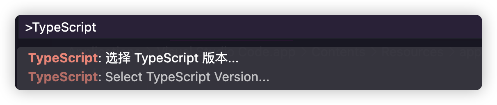

# 类型声明文件的来源

## 概述

+ 类型声明文件主要有以下三种来源：

  + TypeScript 编译器自动生成
  + TypeScript 内置类型文件
  + 外部模块的类型声明文件，需要自己安装

## 来源之自动生成

+ 只要使用编译选项declaration，编译器就会在编译时自动生成单独的类型声明文件
+ 是在tsconfig.json文件里面，打开这个选项

  ```js
  {
    "compilerOptions": {
      "declaration": true
    }
  }
  ```

+ declaration这个属性还有其他两个属性有强关联：

  + declarationDir：指定生成的声明文件 `d.ts` 的输出目录
  + emitDeclarationOnly：只输出 `d.ts` 文件，不输出 JavaScript 文件
  + declarationMap：为 `d.ts` 文件创建源映射

## 来源之内置声明文件

+ 安装 TypeScript 语言时，会同时安装一些内置的类型声明文件，主要是内置的全局对象（JavaScript 语言接口和运行环境 API）的类型声明。这也就是为什么string，number等等基础类型，Javascript的api直接就有类型提示的原因

+ 内置声明文件位于 TypeScript 语言安装目录的lib文件夹内

  

+ 这些内置声明文件的文件名统一为 `lib.[description].d.ts` 的形式，其中description部分描述了文件内容。比如，lib.dom.d.ts这个文件就描述了 DOM 结构的类型
+ 如果想了解对应的全局对象类型接口，可以去查看这些内置声明文件。
+ tsconfig.json中的配置target和lib其实就和内置声明文件是有关系的
+ TypeScript 编译器会自动根据编译目标target的值，加载对应的内置声明文件，默认不需要特别的配置
+ 我们也可以指定加载哪些内置声明文件，自定义配置lib属性即可:

  ```js
  "lib":["es2020","dom","dom.iterable"]
  ```

+ 为什么我们没有安装typescript之前也有提示？

  + 这是由于我们的VS Code等IDE工具在安装或者更新的时候，已经内置了typescript的lib。一般在你的 `VS Code安装路径` -> `resources` -> `app` -> `extensios` -> `node_modules` -> `typescript` 下
  + 如果你的VS Code直没有升级，就有可能导致本地VS Code的typescript版本跟不上的情况，如果你的项目目录下，也安装的的有typescript，我们是可以进行切换的。

  + 在VS Code中使用快捷键ctrl(command) + shift + P，输入TypeScript

    

  + 选择Select Typescript Version...

    

  + 你可以选择使用VS Code版本还是项目工作区的版本

## 来源之外部类型声明文件

+ 如果项目中使用了外部的某个第三方库，那么就需要这个库的类型声明文件。这时又分成三种情况了

  1、 第三方库自带了类型声明文件（例如 `axios`）

  2、社区制作的类型声明文件（例如 `lodash` 下载 `npm i --save-dev @types/lodash`）

  3、没有类型声明文件
