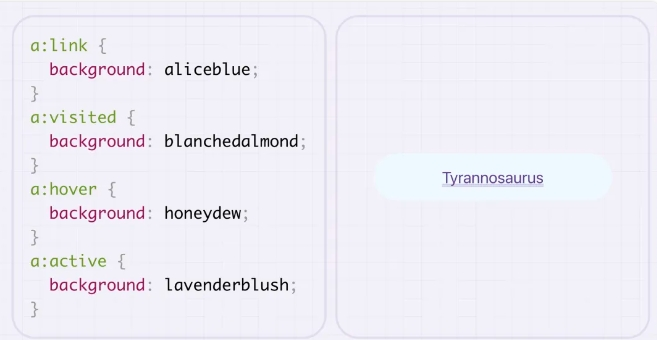

# 链接伪类选择器

## 概述

+ 用于选择链接处于不同状态的元素
+ 它们最常与链接一起使用，但是 :active 也适用于按钮，而 :hover 可以用于各种元素

  + `:link`：选取未被访问过的链接，用于为用户尚未点击的超链接设置样式。

  + `:visited`：选取已经被用户访问过的链接，用于为用户之前点击过的超链接设置样式。

  + `:hover`：当用户指针（例如鼠标光标）悬停在某些元素（通常是链接）上时，选取这些元素。

  + `:active`：在元素（通常是链接或按钮）被激活时，例如用户点击它们的瞬间，选取这些元素。

+ 这 4 个伪类可用于提高用户交互性，例如增加链接的可见度，使其更加显著突出，从而改善用户体验

  

## :hover

+ 选中某些元素的某种状态

  ```css
  /* 鼠标悬停 */
  a:hover {}

  /* 激活状态-鼠标按下状态 */
  a:hover {}
  ```

