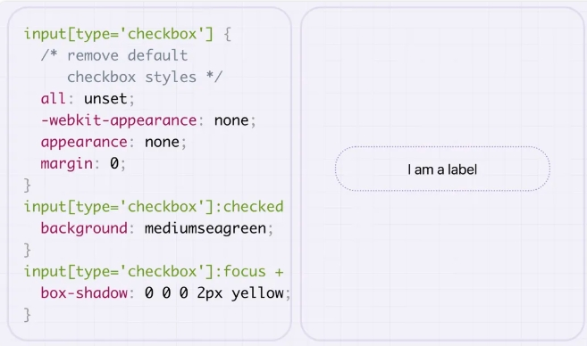
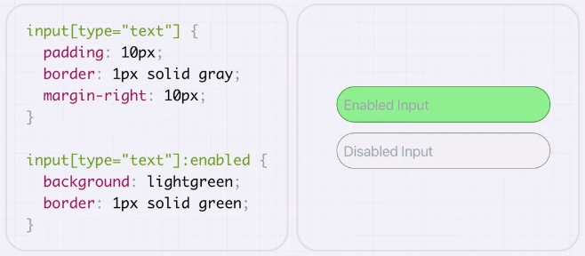
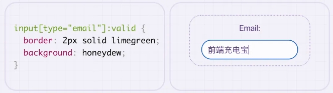

# form 表单

## :focus 获得焦点

+ `:focus` 伪类用于选择当前获得焦点的元素。当用户与网页上的表单元素进行交互时，可以通过点击或键盘导航，使某个特定的输入框处于焦点状态
+ 这意味着用户的输入将直接应用到该输入框上

  ```css
  input:focus {
    border: 2px silid deeps;
    background: lightcyan;
    ouline: none;
    box-shadow: 0 0 8px red;
  }
  ```

  

## :checked 被选中或选择

+ `:checked` 伪类用于选择当前被选中或选择的单选按钮、复选框或 select 元素的选项。

  

## :disabled 被禁用

+ :disabled 伪类用于匹配被禁用的表单元素，例如按钮或文本输入框

  

## :enabled

+ :enabled 伪类用于匹配可以交互和接收输入的表单元素

  

## :valid

+ :valid 伪类用于选择具有与其属性（如 pattern、type 等）所指定要求相匹配的内容的输入元素。

+ 当 input 元素的内容符合其属性所指定的要求时，可以使用 :valid 伪类选择它们。

  

## :invalid

+ :invalid 伪类用于选择具有内容不符合要求的输入元素。

+ 当input元素的内容不符合其要求时，可以使用 :invalid 伪类来选择它们。

    

## :required

+ :required 伪类用于选择具有 required 属性的输入元素，该属性表示在提交表单之前必须填写它们。

+ 当 input 元素具有 required 属性时，可以使用 :required 伪类选择它们。

  

## :optional

+ :optional 伪类用于选择没有 required 属性的输入元素，这意味着它们不是必填项。

+ 当input 元素没有 required 属性时，可以使用 :optional 伪类选择它们。

  
