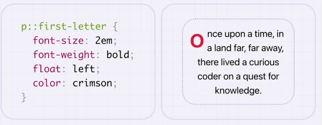
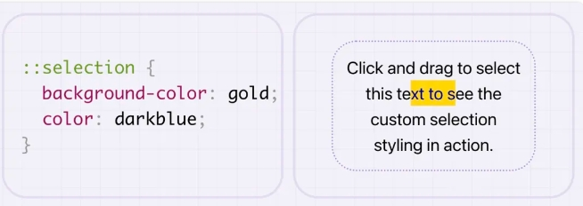
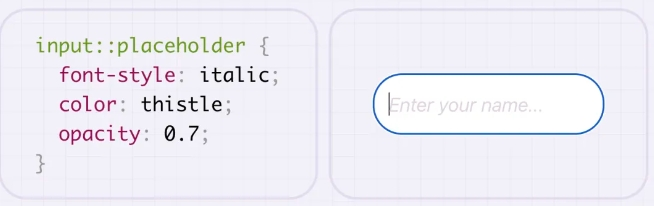

# 伪元素选择器

## 概述

+ 使用


## 分类

+ `::first-letter`

+ `::first-line`

+ `::selection`

## ::after 将显示在其之后

  ```css
  /* 内部的第一个 */
  span::before {
    content: "", /* 内容 */
  }
  ```

  

## ::before

+ 将显示在主元素内容之前

  ```css
  /* 内部的最后一个 */
  span::before {
    content: "", /* 内容 */
  }
  ```

  

## ::first-letter 首字母选择

+ `:first-letter` 用于选择并修改块级元素的第一个字母，从而应用特定的样式
+ 这个伪元素只能选择每个块级元素的第一个字母，并且仅在有文本内容的时候生效

  

## ::first-line 首行选择

+ `:first-line` 选择并修改块级元素的第一行，从而应用特定的样式
+ 这个伪元素只能选择每个块级元素的第一行，并且仅在有文本内容的时候生效

  

## ::selection 鼠标选中文本的时候

+ `::selection`

+ 用来匹配突出显示的文本

+ 浏览器默认情况下，用鼠标选择网页文本是 蓝底白字

+ 设置不能用鼠标选中 `user-select: none;`

  

## ::placeholder

+ 用于选择并修改表单字段的占位符文本，从而应用特定的样式。占位符文本是在用户未输入任何内容时显示的默认文本

  
