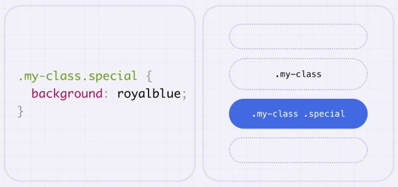
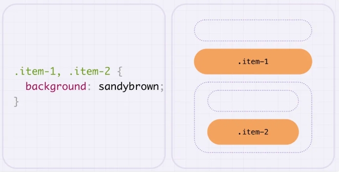
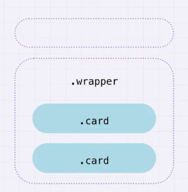

# 选择器的组合

## 组合选择器

+ 连接两个或多个类名或 ID，以选择具有所有指定类名/ID的元素

  ```css
  .my-class.special {
    background: coral;
  }
  ```

  

+ 在**并列选择器**中，**标签选择器**和**id选择器**和**class选择器**在一起，标签选择器必须放前面

  ```css
  div.demo {}
  ```

## 多重选择器

+ 使用逗号将多个选择器声明分开，这样可以很容易地将相同的样式应用于多个选择器声明

  ```css
  .my-class, .special {
    background: coral;
  }
  ```

  

## 后代选择器

+ 后代选择器表示选择某个元素的所有后代元素，即位于该元素内部的所有子孙元素
+ 在使用后代选择器时，在两个选择器之间加上一个空格，表示前一个选择器所选中的元素中包含的后代元素

  ```css
  .wrapper .card {
    background: coral;
  }
  ```

  

## 相邻选择器

+ 相邻兄弟元素 `+`
+ 相邻选择器用于选择紧接在另一个元素后面的直接相邻兄弟元素的选择器，使用加号（`+`）作为组合符号，将两个选择器连接起来
+ 它选择的是位于第一个选择器后紧邻的同级元素

  ```css
  .item-1 + div {
    background: coral;
  }
  ```

  

## 子选择器

+ 子选择器用于选择某个元素的直接子元素，使用大于号（>）作为组合符号，将两个选择器连接起来
+ 它选择的是父级元素下的直接子元素，即元素树结构中的一级关系

  ```css
  .wrapper > div {
    background: coral;
  }
  ```

  

## 通用兄弟选择器

+ 后面出现所有的兄弟元素
+ 通用兄弟选择器使用波浪号（即通用兄弟组合符）来选择在第一个选择器之前的所有元素，而不要求它们是第一个选择器的直接兄弟元素

  ```css
  .item-1 ~ div {
    background: coral;
  }
  ```
