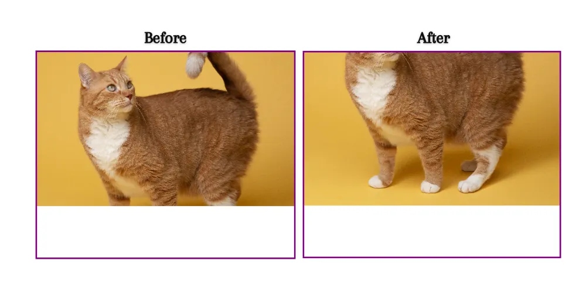

# object-position

## 概述

+ `object-position` 属性与 `object-fit` 属性一起使用，用于指定图像或视频在其内容框内的 x/y 坐标上的位置

  

  ```css
  <div>
    
  </div>

  div {
    width: 500px;
    height: 400px;
    border: 3px solid purple;
  }

  img {
    width: 500px;
    height: 300px;
    object-fit: cover;
    object-position: bottom right;
  }
  ```

## 语法

+ `object-position` 属性用于指定替换元素（如 ``、`<video>` 或 `<iframe>`）在其容器中的位置
+ 它可以与` object-fit` 属性一起使用，以控制替换元素的大小和位置

+ 当使用 `object-fit` 属性调整替换元素的大小时，可能会在容器中留下空白区域
+ `object-position` 属性允许我们根据需要将替换元素在容器内进行精确定位，以填充空白区域

+ object-position 属性接受两个值：

  + 水平定位：使用关键字 left、center 或 right，或者使用百分比或长度值来指定水平方向上的位置

  + 垂直定位：使用关键字 top、center 或 bottom，或者使用百分比或长度值来指定垂直方向上的位置


