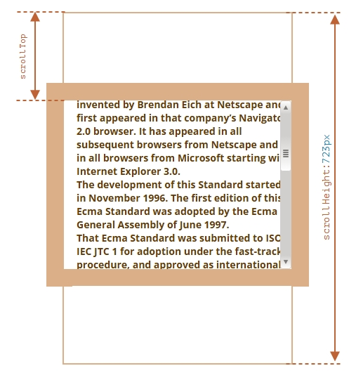

# scrollLeft scrollTop

## 概述

+ 属性 `scrollLeft` 、 `scrollTop` 是元素的隐藏、滚动部分的 `width` / `height`

+ 换句话说， `scrollTop` 就是“已经滚动了多少”

+ 在下图中，我们可以看到带有垂直滚动块的 `scrollHeight` 和 `scrollTop`

  

## 修改 scrollLeft scrollTop

+ 大多数几何属性是只读的，但是 `scrollLeft` 、 `scrollTop` 是可修改的，并且浏览器会滚动该元素

  ```js
  // 元素内容向下滚动 10px
  elem.scrollTop += 10
  ```

+ 将 `scrollTop` 设置为 0 或一个大的值，例如 1e9，将会使元素滚动到顶部/底部
