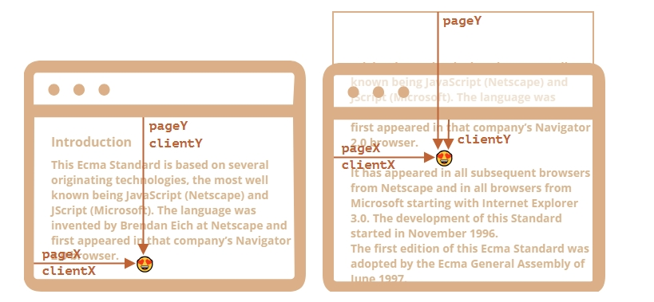

# 基础

## 概述

+ 大多数 JavaScript 方法处理的是以下两种坐标系中的一个

  + 相对于窗口 —— 类似于 position:fixed，从窗口的顶部/左侧边缘计算得出。我们将这些坐标表示为 clientX/clientY
  + 相对于文档 —— 与文档根（document root）中的 `position:absolute` 类似，从文档的顶部/左侧边缘计算得出。我们将它们表示为 pageX/pageY

  

+ 当文档滚动了：

  + pageY —— 元素在文档中的相对坐标保持不变，从文档顶部（现在已滚动出去）开始计算
  + clientY —— 窗口相对坐标确实发生了变化（箭头变短了），因为同一个点越来越靠近窗口顶部
