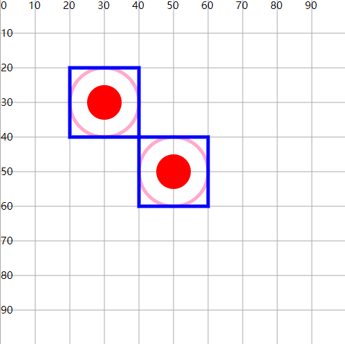

# defs元素

## 概述

+ 定义可重用的元素，可以包含多个图形，本身并不显示
+ 可以配合use在多个地方复用

  ```html
  <defs>
    <g id="g3" fill="none" stroke-width="1">
        <circle cx="10" cy="10" r="10" stroke="#fac"/>
        <rect  x="0" y="0" width="20" height="20" stroke="blue" />
        <circle cx="10" cy="10" r="5" fill="red"/>
    </g>
  </defs>

  <use xlink:href="#g3" x="20" y="20" />
  <use xlink:href="#g3" x="40" y="40" />
  ```

  
