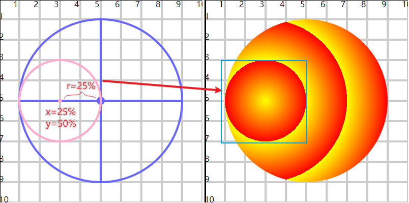

# 径向渐变

## 概述

+ 从一个起始点开始，从里向外圆形渐变

+ 使用 `<radialGradient>` 标签定义径向渐变

  ```html
  <defs>
    <radialGradient id="gradient1">
        <stop offset="0" stop-color="#ff0" />
        <stop offset="100%" stop-color="#f00" />
    </radialGradient>
  </defs>

  <circle cx="50" cy="50" r="40" fill="url(#gradient1)"/>
  ```

+ 默认在整个图形区域进行渐变

  + 使用cx cy r fr 控制渐变的区域

  + cx cy 定义原点位置

  + fr 设置渐变其实位置圆的半径 。 fr没有设置，就是以原点向外渐变。

  + r 设置渐变终止位置圆的半径

  ```html
  <defs>
    <radialGradient id="gradient2" cx="50%" cy="50%" r="30%"  spreadMethod="repeat">
        <stop offset="0" stop-color="#ff0" />
        <stop offset="100%" stop-color="#f00" />
    </radialGradient>
  </defs>

  <circle cx="50" cy="50" r="40" fill="url(#gradient2)"/>
  ```

  ```html
  <defs>
    <radialGradient id="gradient3" cx="50%" cy="50%" r="30%" fr="20%"
                    spreadMethod="repeat" >
        <stop offset="0" stop-color="#ff0" />
        <stop offset="100%" stop-color="#f00" />
    </radialGradient>
  </defs>

  <circle cx="50" cy="50" r="40" fill="url(#gradient3)"/>
  ```

  

+ 这里面的cx cy r百分比，都是基于圆直径的百分比

  + cx="25%" cy="50%" r="25%" x轴直径的25%位置， y轴直径的50%位置，半径长度为直径的25%


## 椭圆

+ 如果是椭圆， 分别是基于长轴直径和短轴直径的百分比

  


