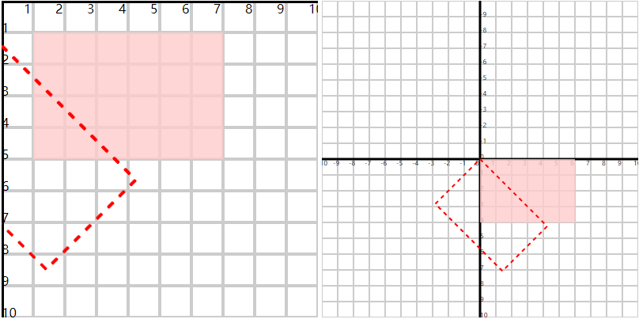

# 旋转 rotate

## 概述

+ 默认是以坐标系原点进行旋转


  ```html
  <rect x="0" y="0" width="60" height="40" fill="#fcc" fill-opacity="0.8"/>
  <rect x="0" y="0" width="60" height="40" fill="none" stroke="#f00" stroke-dasharray="2.5"
      transform="rotate(45)"/>
  ```

  

+ 可以设置旋转的中心点

  + 利用rotate函数指定旋转的中心点 rotate(45,30,20)
  + 利用transform-origin="30 20"

  ```html
  <rect x="10" y="10" width="60" height="40" fill="#fcc" fill-opacity="0.8"/>
  <rect x="10" y="10" width="60" height="40" fill="none" stroke="#f00"
        stroke-dasharray="2.5" transform="rotate(45)" transform-origin="40 30"/>
  <rect x="10" y="10" width="60" height="40" fill="none" stroke="#00f"
        stroke-dasharray="2.5" transform="rotate(45,70,50)"/>

  <circle cx="40" cy="30" r="1" style="fill:red;"/>
  <circle cx="70" cy="50" r="1" style="fill:blue;"/>
  ```

  
