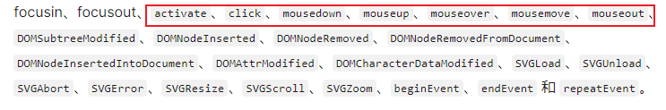

# animate 标签

## 定义

+ 动画标签默认定义在图形标签内部，表示对当前图形进行动画设置

  ```html
  <circle cx="30" cy="30" r="10" fill="#f00">
    <animate
      attributeType="XML"
      attributeName="cx"
      from="30"
      to="60"
      dur="1s"
      repeatCount="1"
      fill="freeze"/>
  </circle>
  ```

+ 也可以单独定义动画标签，利用动画标签的href属性 + 图形的id ， 为指定图形设置动画

  ```html
  <circle cx="30" cy="30" r="10" fill="#f00"></circle>

  <circle id="c2" cx="30" cy="60" r="10" fill="#00f"></circle>

  <animate  href="#c2" ... />
  ```

## 多个动画标签

+ 可以使用多个动画标签，控制多个属性的动画变化

  ```html
  <circle cx="30" cy="30" r="10" fill="#f00">
    <animate
      attributeType="XML"
      attributeName="cx"
      from="30"
      to="60"
      dur="1s"
      repeatCount="1"
      fill="freeze"/>

    <animate
      attributeType="XML"
      attributeName="cy"
      from="30"
      to="60"
      dur="1s"
      repeatCount="1"
      fill="freeze"/>
  </circle>
  ```

## attribute 控制动画属性

+ `attributeType` 设置动画属性的类型， *一般不建议设置*。使用默认即可

  + `auto` 默认
  + `CSS`
  + `XML`

## attributeName

+ `attributeName` 设置具体的动画属性

+ 支持SVG属性，也只是CSS属性

  ```html
  <animate attributeName="r" ... >

  <animate attributeName="cx" ... >

  <animate attributeName="cy" ... >
  ```

## from/to/by 控制动画数值

+ 控制从哪个值到哪个值之间发生动画变化。

  + `from` 从哪个值开始。可以缺省，与图形的初始值相同

  + `to` 到哪个值结束。是一个具体的值

  + `by` 经过多少值，与to二选一，是一个相对的值

  ```text
  from 30 to 60   从30 到60
  from 30 by 60   从30 经过60  [到90]
  ```

## dur 控制动画时长

+ 控制多久完成动画

+ 可以是单一的时间单位 ： 1s , 100ms , 1m
+ 也可以是时间组合 ： `1.500` （1s + 500毫秒） ， `01:01.500` （1min + 1s + 500ms）

## repeatCount 控制动画次数

+ 可以是一个具体的次数： 1 ， 2 ， 3
+ 可以是无限次 ： `indefinite`

## repeatDur 控制动画总时长

+ 在重复动画时，最大动画时长（相当于时间去设置动画的结束，与 `repeatCount` 类似）

  + 例如：1s完成一次动画， 无限动画。 但规定只会进行5s中的动画，相当于完成5次就结束

## fill 控制最终形态

+ 控制动画执行完毕时，那一时刻的状态

  + `remove` 默认， 移除动画最终的效果，从而恢复开始状态
  + `freeze`  保留动画最终的效果

## begin/end 控制动画起始

+ 控制动画何时开始/结束

  + 默认情况下是加载即开始
  + 动画效果执行完毕即结束

+ `end` 与 `begin` 有相同的控制特性

+ 方式1：控制动画延迟开始

  + `begin="2s"` 2s后开始动画

+ 方式2：控制动画在某一个图形事件后开始

  + `click` , `mouseover` , `mousedown` , `mouseout` , `moursemove` 等
  + 也可以是当前图形事件
  + `begin="id.click"` 这里是是图形标签的id

  

  ```html
  <circle cx="30" cy="30" r="10" fill="#f00">
    <animate
      attributeName="cx"
      from="30"
      to="60"
      dur="1s"
      begin="btn2.click"
      fill="freeze"/>
  </circle>

  <g style="cursor:pointer" id="btn2">
    <rect x="40" y="60" width="20" height="10" rx="5" ry="5" fill="#ccc" stroke="#000" />
    <text x="50"  y="67" font-size="6" text-anchor="middle">移入</text>
  </g>
  ```

+ 方式3：控制动画在某一个动画开始/结束时开始 `begin="id.end"`

  + 这里是动画标签的id

  ```html
  <rect x="20" y="20" width="0" height="10" fill="#f00">
    <animate id="a31" attributeType="XML"
      attributeName="width"
      to="20"
      dur="2s"
      begin="2s"
      fill="freeze"/>
  </rect>

  <rect x="40" y="30" width="0" height="10" fill="#f00">
    <animate  attributeType="XML"
      attributeName="width"
      to="20"
      dur="2s"
      begin="a31.end"
      fill="freeze"/>
  </rect>
  ```

+ 方式4：可以控制多次动画的开始条件， 多个条件使用分号分割

  ```
  id="a41" begin="2s;a42.end"

  id="a42" begin="a41.end"
  ```

  ```html
  <rect x="20" y="20" width="0" height="10" fill="#f00">
    <animate id="a31" attributeType="XML"
      attributeName="width"
      to="20"
      dur="2s"
      begin="2s;a32.end"
      fill="freeze"/>
  </rect>

  <rect x="40" y="30" width="0" height="10" fill="#f00">
    <animate id="a32" attributeType="XML"
      attributeName="width"
      to="20"
      dur="2s"
      begin="a31.end"
      fill="freeze"/>
  </rect>
  ```

+ 方式5：制某一个动画执行指定次数后，当前动画开始

  ```
  begin="a51.repeat(2)"
  ```

  ```html
  <rect x="20" y="20" width="0" height="10" fill="#f00">
    <animate id="a51" attributeType="XML"
      attributeName="width"
      to="20"
      dur="2s"
      begin="2s"
      fill="freeze"
      repeatCount="3"
    />
  </rect>

  <rect x="40" y="30" width="0" height="10" fill="#f00">
    <animate  attributeType="XML"
      attributeName="width"
      to="20"
      dur="2s"
      repeatCount="3"
      begin="a51.repeat(2)"
      fill="freeze"
    />
  </rect>
  ```

## restart 控制重复动画

+ 控制重复动画

  + `always` 默认值， 任何时刻都允许重新开始动画
  + `whenNotActive` 完成一次动画，才能开始下一次动画
  + `never` 不能重复动画（只能执行一次）

## values/keyTimes 控制动画过程

+ 可以对动画过程拆分控制

  + `values` 提供过程中多个点的值，包含开始和结束（`from` 、 `to` 和 `by` 失效）

    ```html
    <circle cx="30" cy="30" r="10" fill="#f00">
      <animate
        attributeName="cx"
        values="30;90;30"
        dur="2s"
        fill="freeze"/>
    </circle>
    ```

  +  `keyTimes` 配合 `values` 使用。

    +  针对于 `values` 的分段， 设置每一段的时长（百分比）
    + 类似于CSS中的@keyframes

  ```html
  <!-- 0-0.25的时间(1/4) 完成30-90的运动 （1s完成）-->
  <!-- 0.25-1的时间(3/4)完成90-30的运动 （3s完成） -->
  <circle cx="30" cy="30" r="10" fill="#f00">
    <animate
      attributeName="cx"
      values="30;90;30"
      keyTimes="0;0.25;1"
      dur="4s"
      fill="freeze"/>
  </circle>
  ```

+ 使用上述属性，对动画过程做了分段运动。但每一段的运动默认都是匀速的
+ 可以使用 `calcMode` 控制运动的方式

## calcMode 控制运动速度

+ 控制动画在(每一段)运动过程中速度变化

  + linear 默认 ， 每一段都匀速

    + 每一段的长短不同， 彼此间速度不同

  + `paced` 从始至终匀速， `keyTimes` 无效

  + discrete 直接跳跃到目标位置，没有中间的运动过程

  + spline (三次贝塞尔)曲线型变化

    + 可以实现先快后慢再快等
    + 需要配合 `keySplines` 属性

## keySplines 控制曲线速度

+ 配合 `caclMode="spline"` , 实现每一段速度的贝塞尔曲线变化


