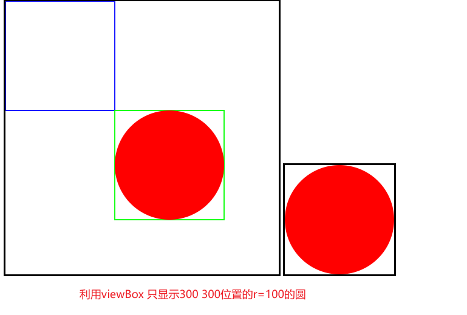

# viewBox

## viewBox作用特点

+ 坐标系
+ 每一个svg标签，都会有一个自己的坐标系。
+ 这个坐标系是隐式
+ 坐标系是无穷大的
+ 这个坐标系还有其他的象限部分，只不过默认窗口左上角为0 0点。 向右为x正，向下为y正

  

## viewBox属性

+ `viewBox="x y width height"`

+ 指定一个视口的大小和位置，用来展示坐标系中指定的部分

  + `x` `y` 设置视口的起始位置
  + `width` `height` 设置视口的区域

  ```html
  <svg id="svg" width="500" height="500"  style="border:solid #000;">
    <circle cx="300" cy="300" r="100" fill="red"/>
  </svg>
  ```

  

  ```html
  <svg id="svg" width="200" height="200"
    viewBox="200 200 200 200" style="border:solid #000;">
    <circle cx="300" cy="300" r="100" fill="red"/>
  </svg>
  ```

  

### viewBox属性的 width 和 height

+ 确定最终图形展示的大小

  + 首先，使用 `viewBox` 确定了要展示图形的部分（位置）
  + 接下来就可以使用 `width` 和 `height` 设置展示图形的大小
  + 如果 `width` 和 `height` 的区域比 `viewBox` 区域大， 就会等比例放大
  + 否则会等比例缩小

  ```html
  <svg id="svg" width="500" height="500"
      viewBox="200 200 200 200" style="border: solid #000">
    <circle cx="300" cy="300" r="100" fill="red" />
  </svg>
  ```

  


