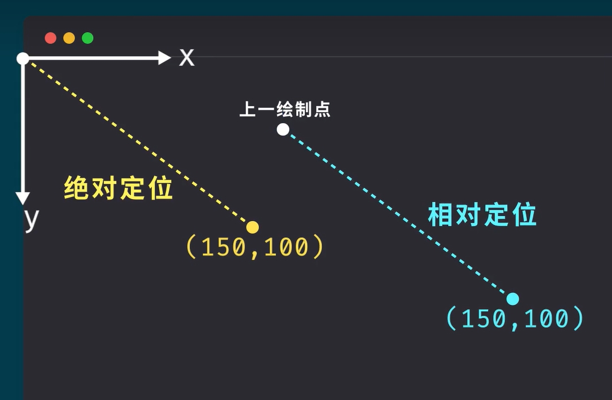
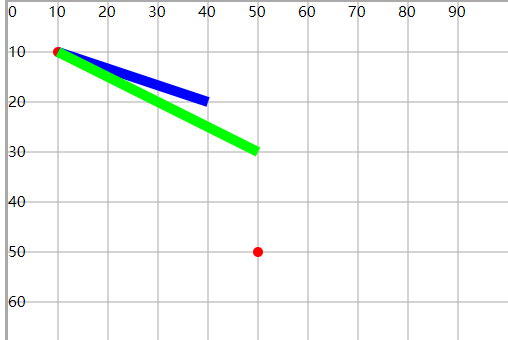

# 直线

## 直线

+ path 元素的形状是通过属性 `d` (draw: 绘制)定义的，属性d的值是一个“命令 + 参数”的序列

+ d属性

  + M 移动到
  + L 画直线到
  + Z 闭合路径

+ 每一个命令都用一个关键字母来表示，比如，字母“M”表示的是“Move to”命令，当解析器读到这个命令时，它就知道你是打算移动到某个点
+ 跟在命令字母后面的，是你需要移动到的那个点的 x 和 y 轴坐标
+ 比如移动到 (10,10) 这个点的命令，应该写成 `“M 10 10”`
+ 这一段字符结束后，解析器就会去读下一段命令
+ 每一个命令都有两种表示方式

## 命令大小写

+ 一种是用*大写字母*，表示采用绝对定位(屏幕坐标原点)
+ 另一种是用小写字母，表示采用相对定位（例如：从上一个点开始，向上移动 10px，向左移动 7px）

  

+ 示例

  ```html
  <!-- 从(10,10)点 向(20,20)点画直线 — 绝对位置 -->
  <path d="M10 10 L40 20"
      fill="none" stroke="#00f" stroke-width="2" />

  <!-- 新位置距原位置x轴距离为20， y轴距离20 — 相对位置 -->
  <path d="M10 10 l40 20"
      fill="none" stroke="#0f0" stroke-width="2" />
  ```

  

## d属性之 M 或 m

+ M(Move to)命令：表示起点

  ```html
  <!-- (150,0) -->
  <path d="M 150 0"/>

  <!-- 或者 -->
  <path d="M150 0"/>
  ```

## d属性之 L 或 l

+ L命令(line to)

  ```html
  <!-- (150,0) -->
  <path d="M 150 0 l 75 200"/>

  <!-- 或者 -->
  <path d="M150 0 l75 200"/>
  ```

  ```html
  <path d="
    M18 3
    L46 3
    L46 40
    L61 40
    L32 68
    L3 40
    L18 40
    Z
  " stroke="red"/>
  ```

## d属性之H h 和 V v

+ H，绘制水平线
+ V，绘制垂直线
+ 这两个命令都只带一个参数，标明在 x 轴或 y 轴移动到的位置，因为它们都只在坐标轴的一个方向上移动

  ```
  H x
  (or)
  h dx
  V y
  (or)
  v dy
  ```

  ```html
  <!-- 画笔移动到 (10,10) 点，由此开始，向右移动 80 像素构成一条水平线，然后向下移动 80 像素，然后向左移动 80 像素，然后再回到起点 -->
  <path d="M 10 10 h 80 v 80 h -80 Z" fill="transparent" stroke="red"/>
  ```

  ```html
  <path d="M30 30 H70 V70 H30"
      fill="none" stroke="#00f" stroke-width="2" />
  ```

  

## d属性之 Z 或 z 闭合路径

+ Z命令会从当前点画一条直线到路径的起点，尽管我们不总是需要闭合路径，但是它还是经常被放到路径的最后
+ 另外，Z 命令*不用区分大小写*

  ```html
 <path d="M30 30 H70 V70 H30 Z"
      fill="none" stroke="#00f" stroke-width="2" />
  ```

  
