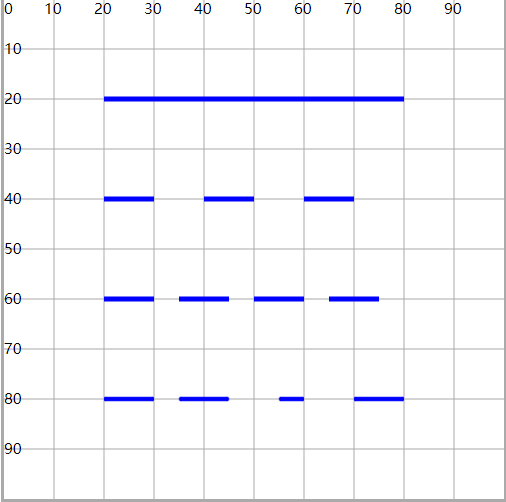

# stroke 描边属性

## 概述

+ `stroke` : 设置描边颜色（边框）

+ `stroke-width` : 设置描边粗细

+ `stroke-opacity` : 设置描边颜色的透明度

+ `stroke-linecap` : 设置线段两端的形状

  + `butt` 直边（默认）
  + `round` 圆角边
  + `square` 视觉效果与butt类似， 两端使用了矩形形状(与butt效果相比会长出一块)

  ```html
  <line x1="30" y1="20" x2="80" y2="20" stroke="#00f" stroke-width="3" stroke-linecap="butt"/>
  <line x1="30" y1="50" x2="80" y2="50" stroke="#00f" stroke-width="3" stroke-linecap="round"/>
  <line x1="30" y1="80" x2="80" y2="80" stroke="#00f" stroke-width="3" stroke-linecap="square" />
  ```

  

+ `stroke-linejoin` : 设置折线连接点的形状

  + `miter` 尖的（默认）
  + `round` 圆
  + `bevel` 平的

  ```html
  <polyline points="20 10,50 50,80 10" stroke="#00f" stroke-width="3" fill="none" stroke-linejoin="miter" />
  <polyline points="20 30,50 70,80 30" stroke="#00f" stroke-width="3" fill="none" stroke-linejoin="round"/>
  <polyline points="20 50,50 90,80 50" stroke="#00f" stroke-width="3" fill="none" stroke-linejoin="bevel" />
  ```

  

+ `stroke-dasharray` : 使用虚线设置描边，并设置虚线及空白的长度

  + `stroke-dasharray="10"` 每一段线长度为10，两段线之间的空白为10
  + `stroke-dasharray="10 5"` 每一段线长度为10，两段线之间的空白为5
  + `stroke-dasharray="10 5 10"` 设置时后面的长度会复制前面的数值 10 5 10 10 5 10 10 5 10

  ```html
  <path d="M20 20H80"
      fill="none" stroke="#00f" stroke-width="1" />
  <path d="M20 40H80"
        fill="none" stroke="#00f" stroke-width="1" stroke-dasharray="10" />
  <path d="M20 60H80"
        fill="none" stroke="#00f" stroke-width="1" stroke-dasharray="10 5" />
  <path d="M20 80H80"
      fill="none" stroke="#00f" stroke-width="1" stroke-dasharray="10 5 10" />
  ```

  

+ `stroke-dashoffset` : 配合虚线描边属性 ， 设置虚线开始的位置（偏移）

  + 正数向左偏移， 负数向右偏移
  + 可以用来实现*动态文字*效果

  ```html
  <path d="M20 20H80"
      fill="none" stroke="#00f" stroke-width="1"  stroke-dasharray="10" />
  <path d="M20 30H80"
        fill="none" stroke="#00f" stroke-width="1" stroke-dashoffset="-5" stroke-dasharray="10" />
  <path d="M20 40H80"
        fill="none" stroke="#00f" stroke-width="1" stroke-dashoffset="5" stroke-dasharray="10" />
  <path d="M20 50H80"
        fill="none" stroke="#00f" stroke-width="1" stroke-dashoffset="45" stroke-dasharray="60" />
  ```

  

## 示例

+ 设置偏移位置，生成动画(css)

  ```html
  <style>
    #c1{
      fill:#fac;
      stroke: skyblue;
      stroke-width: 2;
      stroke-dasharray: 200;
      transition: 2s;
    }

    #c1:hover{
      fill:#caf;
      stroke: blueviolet;
      stroke-dashoffset: 200;
      /* stroke-dasharray: 200; */
    }
  </style>

  <svg xmlns="http://www.w3.org/2000/svg" width="100" height="100" style="border: #aaa solid">
    <path id="c1" d="M20 50, A30 30 0 0 1 80 50, A30 30 0 0 1 20 50" />
  </svg>

+ 设置偏移位置，生成动画(js)

  ```html
  <style>
    #c1{
      fill:#fac;
      stroke: skyblue;
      stroke-dashoffset: 0;
      stroke-width: 2;
      /* stroke-dasharray: 0; */
      transition: 2s;
    }
  </style>

   <svg xmlns="http://www.w3.org/2000/svg" width="100" height="100" style="border: #aaa solid">
    <path id="c1" d="M20 50, A30 30 0 0 1 80 50, A30 30 0 0 1 20 50" />
  </svg>

  <script>
    const fillColorArr = ['#caf', '#fac'];
    const strokeColorArr = ['blueviolet', 'skyblue'];
    const c1 = document.querySelector("#c1");
    const len = c1.getTotalLength();

    c1.setAttribute('stroke-dasharray', len);

    c1.style.fill = "#caf";
    c1.style.stroke = "blueviolet";
    c1.style.strokeDashoffset = len;

    // 准备动画，连续改变（上一次过渡完成，触发下一次过渡）

    // 方式1 setTimeout

    // 方式2 setInterval

    // 方式3 过渡事件函数，每完成一次过渡，就会触发事件
    let fillIndex = 0;
    let strokeIndex = 0;
    c1.ontransitionend = function (e) {

      // 回到初始状态
      if(e.propertyName === 'fill') {
        fillIndex = fillIndex === 0 ? 1 : 0;
        c1.style.fill = fillColorArr[fillIndex];
      }
      if(e.propertyName === 'stroke') {
        strokeIndex = strokeIndex === 0 ? 1 : 0;
        c1.style.stroke = strokeColorArr[strokeIndex];
      }
      if(e.propertyName === 'stroke-dashoffset') {
        c1.style.strokeDashoffset = parseInt(c1.style.strokeDashoffset) + len * 1;
      }

    }

  </script>
  ```
