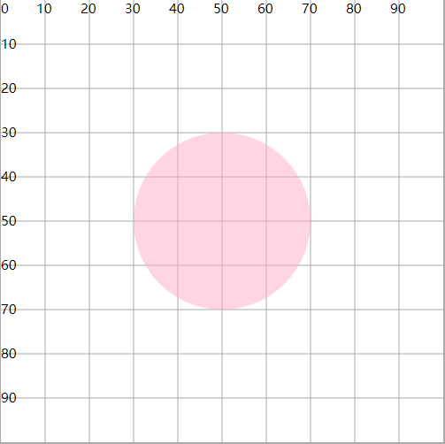

# fill 填充属性

## 概述

+ fill ：图形区域的颜色填充（背景颜色）
+ fill-opacity : 设置填充颜色的透明度

+ fill-rule ： 设置图形绘制过程中，重叠部分的所属规则

  + 通过一些规则，确定重叠的区域是否属于当前图形，从而使得填充有效或失效
  + fill-rule="nonzero"按照顺时针绘制图形时经过这片区域，计数器+1，逆时针绘制图形时经过这片区域，计数器-1，最终的结果为0，表示重叠区域不属于图形（fill失效）。结果非0，表示重叠区域属于图形（fill生效）
  + fill-rule="evenodd" 绘制过程中，经过一次区域，计数器+1. 最终的数量为奇数，表示在图形内，偶数表示在图形外

  ```html
  <circle cx="50" cy="50" r="20" fill="#fac" fill-opacity=".5"/>
  ```

  
