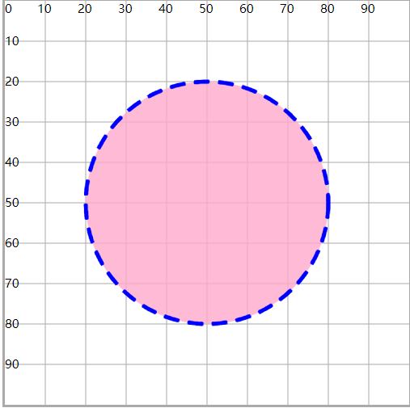

# CSS控制SVG

## 使用CSS设置SVG的效果属性 （fill ，stroke）

+ 主要就是对fill 和 stroke系列设置
+ 还允许对r ， cx ，cy , x , y属性进行设置
+ 有些属性css不支持，d ， points ， x1 y1 , x2 y2

  ```html
  <style>
    #c1{
          cx:50;
          cy:50;
          r:30;
          fill:#fac;
          stroke:#00f;
          fill-opacity: 0.8;
          stroke-width: 1;
          stroke-dasharray: 4 2;
      }
  </style>

  <circle id="c1"/>
  ```

  

## 将CSS属性效果应用在SVG上

+ 绝大多数的css效果，都可以作用在svg上面（动画，渐变，效果）
+ 关于背景和边框，要使用SVG提供的属性 `fill` 和 `stroke` （background和 border无效）
+ `after` 和 `before` 伪类样式也是不支持的

  ```html
  <style>
    #c1{
      fill:#fac;
      stroke: #00f ;
      stroke-width: 2;
      r:30;
      transition: 1s ;
      }
    #c1:hover{
      stroke: #0f0;
      fill:#afc;
      r:40;
    }
  </style>

  <circle id="c1" cx="50" cy="50"/>
  ```

+ svg本身是一个xml语法，可以写在.svg文件中，也可以使用样式

  ```html
  <svg xmlns="http://www.w3.org/2000/svg" viewBox="0 0 100 100"
    width="500" height="500" style="border:#aaa solid" >
    <style>
        circle{
          fill:#fac;
          stroke:#00f;
        }
    </style>

    <circle cx="50" cy="50" r="30" style=""/>
  </svg>
  ```
