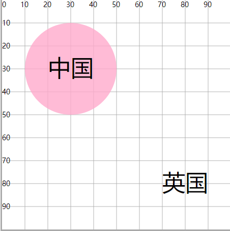

# text文本

## 概述

+ `<text x="20"  y="33" font-size="10" >中国</text>`

  + x 文本左边和y轴的距离
  + y 文本底边和x轴的距离
  + 中文的x和y在显示上会有一些视觉误差

  + dx , dy 相对于x和y的移动

  ```html
  <circle cx="30" cy="30" r="20" fill="#fac" fill-opacity=".8"/>

  <text x="20"  y="33" font-size="10" >中国</text>
  <text x="20"  y="33" dx="50" dy="50" font-size="10" >英国</text>
  ```

  
