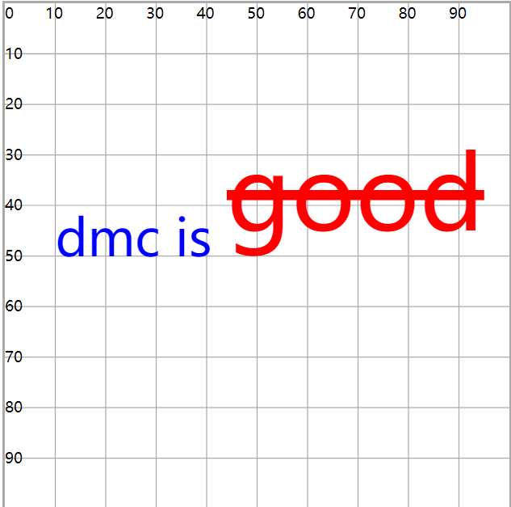

# tspan子标签

## 概述

+ 包裹部分文字，对这部分文字单独做设置
+ 该元素用来标记大块文本的子部分，它必须是一个 `text` 元素或别的 `tspan` 元素的子元素

  ```html
  <text x="10"  y="50" font-size="10" style="color:red" color="green" fill="blue">
    dmc is
    <tspan dy="-5" font-size="20" fill="red" text-decoration="line-through">good</tspan>
  </text>
  ```

+ `tspan` 元素有以下的自定义属性

  + x 和 y 基于坐标轴原点，重新设置子部分文字的位置
  dx和dy 相对于这部分文字原来的位置，重新设置新位置

  
