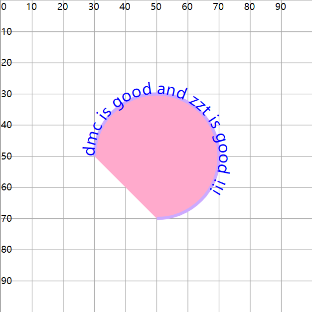

# textPath子标签

## 概述

+ 文字按照 `path` 路径实现一个环绕(展现)
+ 使用 `xlink:href` 属性，链接指定id的path图形

  ```html
  <path id="p1" d="M30 50 A20 20 0 0 1 70 50A20 20 0 0 1 50 70"
      fill="#fac" stroke="#caf" stroke-width="1" />

  <text fill="blue" font-size="5">
      <textPath  xlink:href="#p1">
          dmc is good and zzt is good !!!
      </textPath>
  </text>
  ```

  
