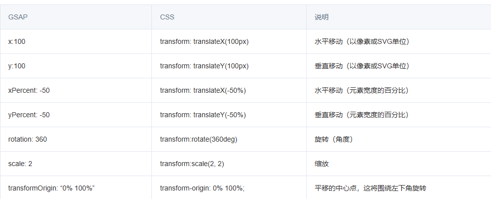

# 变量

## 概述


+ 变量于存储和操作动画的属性值，它是一个对象，包含了有关动画的所有信息
+ 包括transform、repeat、yoyo、delay、ease、stagger等各种动画属性

## transform 变换

+ 在CSS中，如果我们需要实现transform效果，需要这样写

  ```css
  transform: rotate(360deg) translateX(10px) translateY(50%);
  ```

+ 但是，在GSAP中使用transform非常简单，上面的CSS代码在GSAP中我们只需要这样写就可以了

  ```js
  { rotation: 360, x: 10, yPercent: 50 }
  ```

  

  ```js
  gsap.to(box.value, {
    duration: 1,
    x: 200,
    y: 200,
    opacity: 0.5,
    rotation: 180, // 旋转角度
  });
  ```

## 其他属性

+ `duration` 动画的持续时间（秒）默认值：0.5


+ `delay` 动画开始之前的延迟时间（秒）

+ `repeat` 动画重复的次数

+ `yoyo` 如果为 `true` ，则在每次重复时，Tween将以相反的方向运行（类似于摇摆效果）。默认值： `false`

+ `stagger` 每个目标动画之间的时间间隔（以秒为单位）（如果提供了多个目标）

+ `ease` 控制动画过程中的变化速率，默认值为 `"power1.out"`

+ `onComplete` 当动画完成时运行的函数

  ```js
  gsap.to(".box", {
    rotation: 360,
    x: '100vw',
    xPercent: -100,
    duration: 2,
    repeat: 2,
    yoyo: true,
  });
  ```

