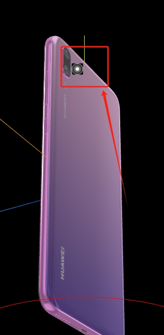

# 模型渲染排序

## 问题

+ three.js 三维场景中，如果出现多个半透明模型对象相互叠加，就会出现渲染瑕疵，这个时候往往需要程序员手动去解决，对于不同的情形有不同的解决方案

  

## 解决

+ three.js 会综合模型创建先后、模型距离相机的远近等多种因素进行排序，不过你可以通过改变 `.renderOrder` 调整渲染顺序

+ 参考 `https://threejs.org/docs/index.html?q=Object#api/zh/core/Object3D` 的 `.renderOrder`

+ 模型的渲染顺序根据 `.renderOrder` 由低到高来排序的
+ 就是 `.renderOrder` 属性值越小的模型对象会优先渲染，所以的模型对象 `.renderOrder` 属性默认值是 0

  ```js
  // 多个半透明模型对象相互叠加，渲染可能会出问题，可以尝试手动排序解决
  mesh.renderOrder = 0; // renderOrder 小的先渲染
  sprite.renderOrder = 1;
  ```

+ 注意：使用 `.renderOrder` 的时候，不要设置 `renderer.sortObject = false` 否则无效
