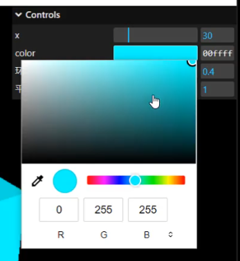

# addColor() 颜色值改变

## 概述

+ `.addColor()` 生成颜色值改变的交互界面

  

  ```js
  const obj = {
    color:0x00ffff,
  };

  // .addColor()生成颜色值改变的交互界面
  gui.addColor(obj, 'color').onChange(function(value){
    mesh.material.color.set(value);
  });
  ```
