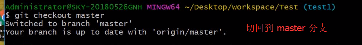
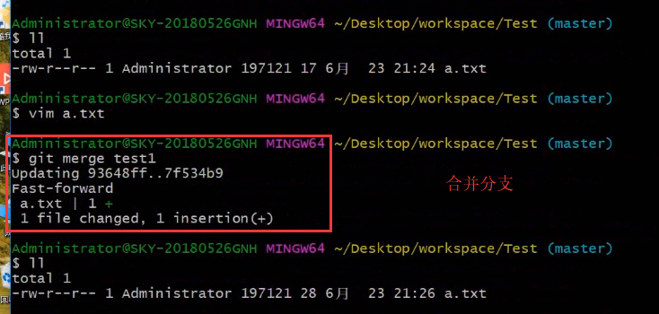
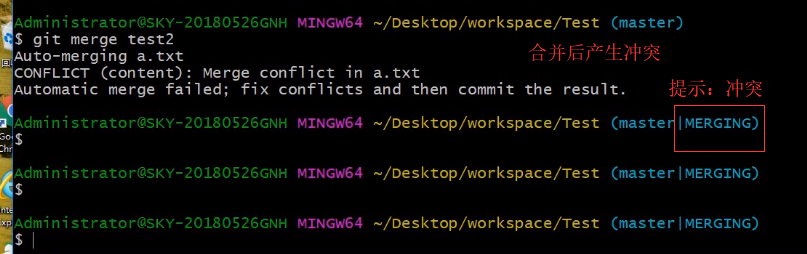
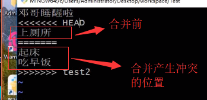
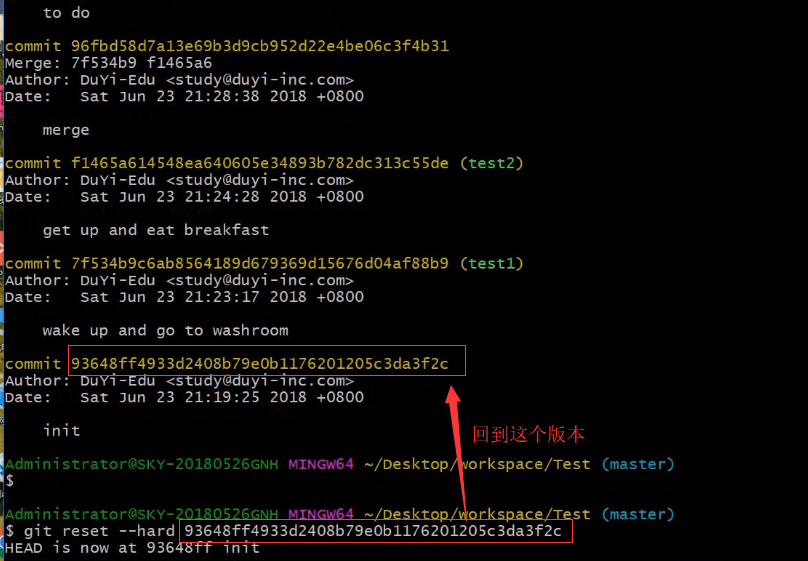

# `Git`操作

## `Git`有关问题

+ 使用`https`访问，就不需要输入密钥

## 命令

1. 用户名 + 邮箱
    + `git config user.name` : 查看绑定`gitHub`的用户名
    + `git config user.email`：查看绑定`gitHub`的邮箱
2. `git clone`: 创建本地仓库
    + `git clone xxx`: xxx：仓库地址
    + `git clone -b fzm xxx`: 下载 `fzm`分支下的代码
3. `git add` :添加代码
4. `git pull` 别人修改了，自己拉取
5. `git commit`: 提交到本地仓库（示例中的宇宙）
    + `git commit -am "描述字符"`：提交到本地仓库
6. `git push`: 推到远程仓库
7. `git merge` :分支合并
8. `git checkout` :切换分支
9. `git reset`: 回到过去
10. `git branch` :查看本地分支
11. `$ git branch -a` 查看项目的分支们(包括本地和远程)
12. `git branch -d <BranchName>` 删除本地分支
13. `git remote -v` 查看 `git` 地址

## 拉取代码

1. `git clone xxx`: xxx：仓库地址
2. `git add .` ：添加到`git`本地分支
    
3. `git commit -am "描述字符"`：提交到本地仓库
    
    
4. `git push`: 提交到远程仓库
    

5. `git clone -b 分支名 url` 获取指定分支的代码

6. `git pull <远程主机名> <远程分支名>:<本地分支名>` 如果远程分支是与当前分支合并，则冒号后面的部分可以省略：`git pull origin next`

## 新建分支 + 切换分支

+ `git branch`: 查看本地分支
+ `git checkout -b test1`：新建`test1`分支（`-b`: 开辟新的分支）
    
    
+ `git checkout master`: 切换到 `master` 分支
    

+ `git checkout -b 本地分支名 origin/远程分支名` : 将远程git仓库里的指定分支拉取到本地

+ 删除本地分支 `git branch -d xxx`

+ 删除远程分支 + 推送到服务器
    1. `git branch -a` :查看所有分支(`remote/origin/分支名`表示的是远程分支)
    2. `git push origin --delete NEWfzm` 删除远程分支

## 合并分支(例如：将 `tset1` 的代码合并到 `master`)

1. `git merge test1`: 合并到 `master`（**记得先回到`master`分支上**）

    
2. 合并产生冲突：在两个分支上对同一个文件进行操作修改
    
3. 产生冲突后文件的样式
    
4. 修改产生冲突的位置
    
5. `git commit -am "merge"` :重新合并
    

## 版本回退

1. `git log` :查看所有提交记录
2. `git reset --hard xxx`
    
    + 提交记录也会清除

## 各类问题

1. 没有回到`master`分支时，`git push`将代码提交到本地
    
2. 解决冲突
