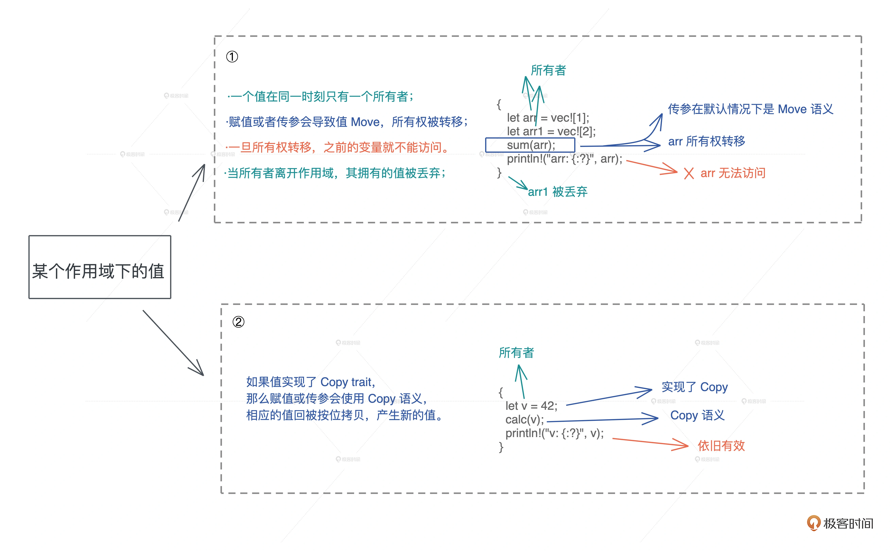

# 移动Move和克隆Clone

## 概述

  - 所有权：一个值只能被一个变量所拥有，且同一时刻只能有一个所有者，当所有者离开作用域，其拥有的值被丢弃，内存得到释放

  - 移动（Move）：赋值或者传参会导致值 Move，所有权被转移，一旦所有权转移，之前的变量就不能访问

  - 克隆（Clone）：如果值实现了 `Copy trait` ，那么赋值或传参会使用 Copy 语义，相应的值会被按位拷贝（浅拷贝），产生新的值

## 所有权规则

  - 一个值只能被一个变量所拥有，这个变量被称为所有者

  - 一个值同一时刻只能有一个所有者。也就是说不能有两个变量拥有相同的值。所以对应刚才说的变量赋值、参数传递、函数返回等行为，旧的所有者会把值的所有权转移给新的所有者，以便保证单一所有者的约束（Move一定）

  - 当所有者离开作用域，其拥有的值被丢弃，内存得到释放

## 所有权解决的问题

  - 解决了谁真正拥有数据的生杀大权问题，让堆上数据的多重引用不复存在

## 移动Move

  - 当你要移动一个值，如果值的类型实现了 `Copy trait`，就会自动使用 `Copy` 语义进行拷贝，否则使用 `Move` 语义进行移动

## 数据类型实现了Copy trait

  - 原生类型，包括函数、不可变引用和裸指针实现了`Copy`

      - 所有整数类型，例如 `i32` 、 `u32` 、 `i64` 等

      - 布尔类型 `bool` ，值为 `true` 或 `false`

      - 所有浮点类型，`f32` 和 `f64`

      - 字符类型 `char`

  - 数组和元组，如果其内部的数据结构实现了Copy，那么它们也实现了 Copy；

## 数据未实现Copy trait

  - 数组和元组，如果其内部的数据结构未实现了Copy，那么它们也未实现了 Copy；

  - 可变引用没有实现Copy；

  - 非固定大小的数据结构，没有实现 Copy
