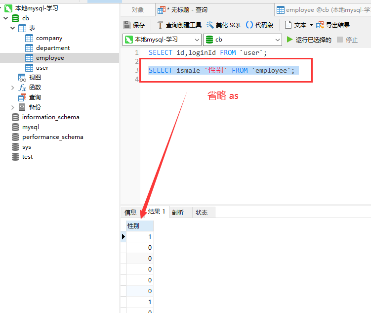

# select

## 基本使用

+ `select ...`

+ select 字段 form `表名`

  ```sql
  -- 单列查询
  SELECT `id` FROM `user`;
  ```

  ```sql
  -- 多列查询
  SELECT `id`, `loginId` FROM `user`;
  ```

## 别名 AS

+ 别名：表示查询出来的列的别名

  ```sql
  -- 方式1
  SELECT ismale as '性别' FROM `employee`;

  -- 多列
  SELECT id, ismale as '性别' FROM `employee`;
  ```

  
  


  ```sql
  -- 方式2
  SELECT `ismale` '性别' FROM `employee`;
  ```

  

## * 所有列

+ `*`：表示查询所有列

  ```sql
  -- 查询 user 表中的所有列
  SELECT * FROM `user`;
  ```

## case

+ `case`：对某一列的数据进行进一步的处理

  ```sql
  -- 普通
  SELECT id, `name`,
  `ismale`
  salary
  FROM employee;
  ```

  

+ 使用 case 写法1

  ```sql
  -- 使用 case
  -- 设置 ismale 栏的内容,当值为 1 的时候，替换成 男
  -- 当值为 0 的时候，替换成 女
  SELECT id, `name`,
  CASE `ismale`
    WHEN 1 THEN
      '男'
    ELSE
      '女'
  END sex,
  salary
  FROM employee;
  ```

  

+ 使用 case 写法2

  ```sql
  SELECT id, `name`,
  CASE 
    WHEN `ismale` = 1 THEN
      '男'
    ELSE
      '女'
  END sex,
  salary
  FROM employee;
  ```

  

  ```sql
  SELECT id, `name`,
  CASE 
    WHEN `ismale` = 1 THEN
      '男'
    ELSE
      '女'
  END sex,
  CASE 
    WHEN `salary` >= 10000 THEN
      '高工资'
    WHEN `salary` >= 5000 THEN
      '中等工资'
    ELSE
      '低工资'
  END `lev`
  FROM employee;
  ```

  

## distinct

+ 去重
+ 一般 **只** 在查询一列的情况下使用

  ```sql
  -- 查询 employee 表的 location 字段
  SELECT DISTINCT `location` FROM `employee` ORDER BY `location`;
  ```
