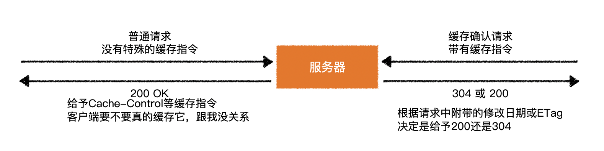
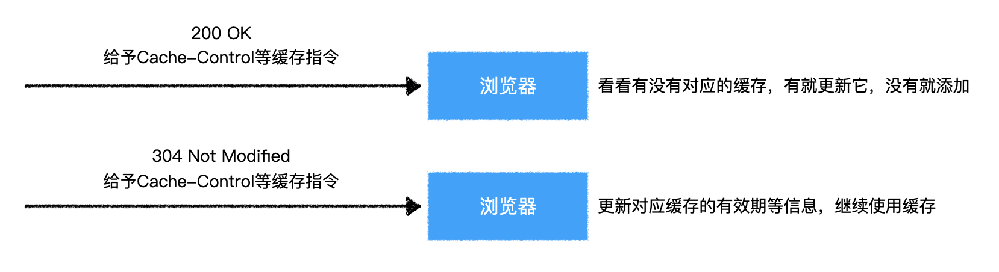

# 总结

## 目录

  - [服务器视角](#服务器视角)

  - [浏览器视角](#浏览器视角)

## 服务器视角

  - 服务器无法知道客户端到底有没有像浏览器那样缓存文件，它只管根据请求的情况来决定如何响应

    

  - 很多后端语言搭建的服务器都会自带自己的默认缓存规则，当然也支持不同程度的修改

## 浏览器视角

  - 浏览器在发出请求时会判断要不要使用缓存

    

  - 当收到服务器响应时，会自动根据缓存指令进行处理

    
