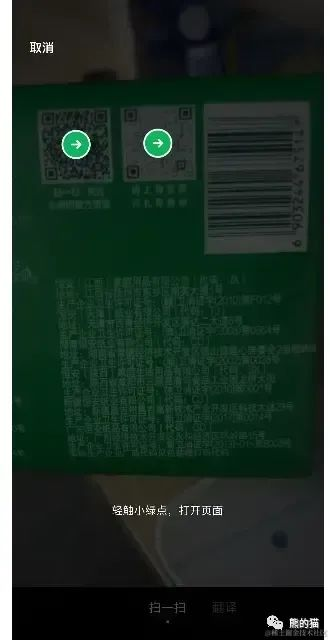

# 实现扫码功能

## 组件库

+ `qr-sanner-wechat` 安装

  ```shell
  npm i qr-scanner-wechat
  ```

+ 使用

  ```js
  import { scan } from 'qr-scanner-wechat';

  // scan 可以接收一个 image 元素或者 canvas 元素作为参数，并且返回一个 promise 类型的值
  ```

+ 参数：`scan` 可以接收一个 `image` 元素或者 `canvas` 元素作为参数，并且返回一个 `promise` 类型的值

+ 返回值：`scan` 函数返回了一个对象

  + `rect` (rectangle 长方形的单词缩写)，这个属性描述了这个插件在什么位置扫描到了二维码

    + rect 使用场景：会存在没有对准一个二维码的图片，或者会遇到一个图片中存在两个二维码的情况
    + 这个 qr-scanner 插件会帮你把二维码所在整张图片的相对位置告诉你，因为这个插件每次调用 scan 函数只会返回一次结果。并不是说图片上有两个二维码，它的识别结果就会有两个，所以说这个 qr-scanner 插件的识别效果也并不是百分之一百准确的

  + `text` 也就是这个图片上隐藏的字符串地址

  

+ 返回结果处理

  + 没有识别到二维码：解决办法就是提示用户重新放置图片即可
  + 存在多个二维码

## 本地扫码功能实现

+ code

  ```html
  <input type="file" @cheng="getImageFromLocal" accept="image/png" />
  

  <script>
    import { scan } from 'qr-scanner-wechat';

    const src=ref("");
    const imgEl = ref<HTMLImageElement>();

    function getImageFromLocal(e: Event) {
      const inputEl = e.target as HTMLInputElement;
      if (!inputEl) return;
      console.log("inputEl.files", inputEl.files);

      const image = inputEl.files[0];
      const url = URL.createObjectURL(image);
      scr.value = url;

      // 讲元素赋值给 scan
      const result = await scan(imgEl.value!);
      console.log('result', result)
    }
  </script>
  ```

## 多个码处理

+ 参考微信的实现效果，当只有一张二维码的时候，它会直接跳转，当有多个二维码的时候，它会将整个页面暂停，并且提示用户有两张二维码，请点击选择一个进行跳转

  

+ 思路

  + 我们首先将完整的照片传给 scan，然后 scan 觉得第一张二维码比较帅，就先识别了它（tips: 这里需要提醒一下，scan 有时候会觉得第二张二维码比较帅，那我就识别第二张二维码，要注意的它的顺序性是随机的)
  + 然后我们想办法盖上遮挡物，然后将这个图片传给 scan，让它再次确认是否有第二个二维码
