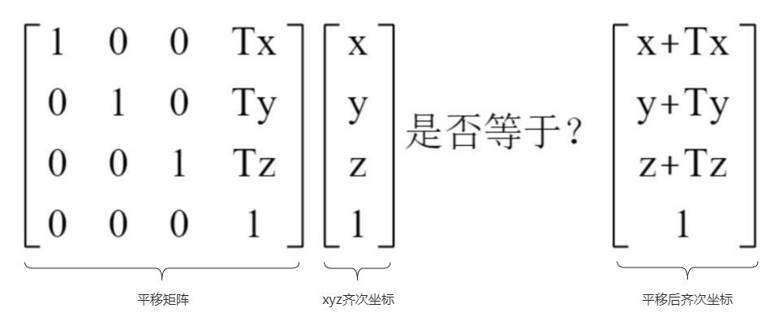
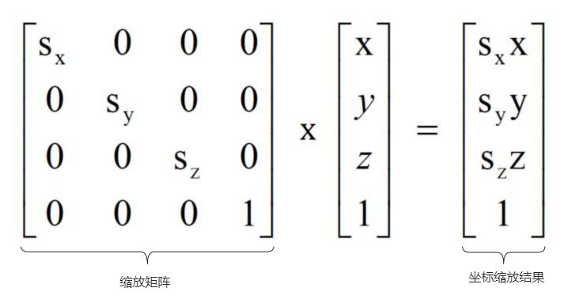

# 数学基础(平移、旋转、缩放矩阵)

## 线性代数、图形学

+ 有《线性代数》、《计算机图形学》基础，更有利于WebGPU的学习
+ 如果你数学基础不好，工作也不用封装3D引擎或数学库，可以不用学习《线性代数》

## 矩阵、矩阵运算规则

+ 矩阵 是图形学中一个比较重要的数学工具
+ m×n 矩阵表示m行n列的矩阵

  

+ 矩阵乘法运算规则

  

## 平移矩阵

+ 一个点的坐标是(x,y,z),假设沿着X、Y、Z轴分别平移Tx、Ty、Tz，毫无疑问平移后的坐标是(x+Tx,y+Ty,z+Tz)

+ 坐标是(x,y,z)转化为齐次坐标坐标是(x,y,z,1),可以用4x1矩阵表示，这种特殊形式，也可以称为列向量
+ 在webgpu顶点着色器代码中也可以用四维向量 `vec4` 表示

  

## 缩放矩阵

+ 通过缩放矩阵可以对顶点的齐次坐标进行缩放

  

## 旋转矩阵

+ 假设一个点的坐标是(x,y,z),经过旋转变换后的坐标为(X,Y,Z)

+ 绕Z轴旋转γ角度,z的坐标不变不变，x、y的坐标发生变化，如果你有兴趣，可以用你高中的三角函数知识推理，可以知道旋转后的坐标：X=xcosγ-ysinγ,Y=xsinγ+ycosγ

  

## 三角函数计算推理过程

+ 三角函数计算推理过程

  ```js
  // 假设旋转前角度A，对应x和y的值

  x = R *cos(A)
  y = R* sin(A)

  // 假设旋转了γ度，对应X和Y的值
  X = R *cos(γ+A)
    = R* (cos(γ)cos(A)-sin(γ)sin(A))
    = R*cos(A)cos(γ) - R*sin(A)sin(γ)
    = xcosγ-ysinγ

  Y = R *sin(γ+A)
    = R* (sin(γ)cos(A)+cos(γ)sin(A))
    = R*cos(A)sin(γ) + R*sin(A)cos(γ)
    = xsinγ+ycosγ
  ```
