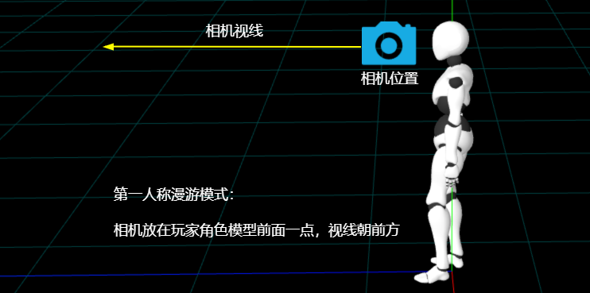

# 快捷键切换第一、第三人称

## 第三人称

+ 注意一点透视投影相机fov视野的角度值会影响，相机与人距离的设置

  

  ```js
  const camera = new THREE.PerspectiveCamera(30,...);
  //玩家角色后面一点  对应fov 30度
  camera.position.set(0, 1.6, -5.5);
  ```

+ 根据透视投影相机规律，fov变大，能够看到的视野范围角度更大

  ```js
  const camera = new THREE.PerspectiveCamera(70,...);

  //玩家角色后面一点  对应fov 70度
  camera.position.set(0, 1.6, -2.3);
  ```

## 第一人称

+ 第一人称，简单点说，就是看不到玩家角色的模型，相当于把相机放在人的前面

  

  ```js
  // camera.position.set(0, 1.6, -2.3);//第三人称
  // camera.lookAt(0, 1.6, 0);
  camera.position.set(0, 1.6, 1);//第一人称
  camera.lookAt(0, 1.6, 2);//目标观察点注意在相机位置前面一点
  ```

+ 如果 `lookAt` 后面执行第一人称代码，不重新执行 `camera.lookAt`，视线方向还是原来的

  ```js
  // z距离人远近具体值，可以根据模型尺寸去测试调节
  camera.position.set(0, 1.6, -2.3);//第三人称
  camera.lookAt(0, 1.6, 0);
  camera.position.set(0, 1.6, 1);//第一人称
  ```

## 第一、第三人称切换

+ 第一、第三人称，快捷键v切换

  ```js
  let viewBool = true;//true表示第三人称，false表示第一人称

  document.addEventListener('keydown', (event) => {
    if (event.code === 'KeyV') {
      if (viewBool) {
        // 切换到第一人称
        camera.position.z = 1; //相机在人前面一点 看不到人模型即可
      } else {
        // 切换到第三人称
        camera.position.z = -2.3; //相机在人后面一点
      }
      viewBool = !viewBool;
    }
  });
  ```
