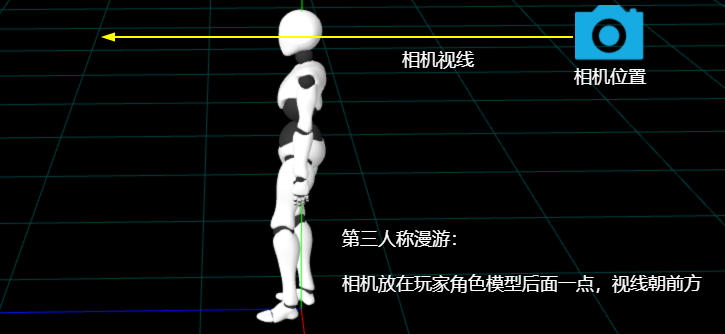

# 鼠标左右拖动改变玩家视角

## 功能

+ 按住鼠标左键，左右拖动，改变玩家角色和相机的视角

## 鼠标事件

+ 鼠标滑动事件

  ```js
  // 鼠标滑动期间，会不停地多次触发鼠滑动事件，直到不再滑动
  document.addEventListener('mousemove', (event) => {
    console.log('触发1次');
  });
  ```

+ 鼠标持续滑动时候，会多次触发滑动事件
+ `event.movementX` 表示本次触发事件相对上次，鼠标左右方向滑动的距离，单位是像素，往右滑动是*正*，往左滑动是*负*

  ```js
  document.addEventListener('mousemove', (event) => {
    console.log('鼠标每次x方向移动距离', event.movementX);
  });
  ```

## 鼠标控制玩家转向

+ 通过鼠标左右滑动距离控制玩家角色模型player旋转

  ```js
  document.addEventListener('mousemove', (event) => {
    // 注意rotation.y += 与 -= 区别，左右旋转时候方向相反
    // event.movementX缩小一定倍数改变旋转控制的灵敏度
    player.rotation.y -= event.movementX / 600;
  });
  ```

## 鼠标左键拖动时候，旋转玩家角色

+ 鼠标左键拖动定义：鼠标左键按下，不松开，左右滑动

+ 1. 记录鼠标左键状态

  ```js
  let leftButtonBool = false; // 记录鼠标左键状态

  document.addEventListener('mousedown', () => {
    leftButtonBool = true;
  });
  document.addEventListener('mouseup', () => {
    leftButtonBool = false;
  });
  ```

+ 2. 判断鼠标左键状态，决定是否旋转玩家角色

  ```js
  document.addEventListener('mousemove', (event) => {
    // 鼠标左键按下时候，才旋转玩家角色
    if(leftButtonBool){
      player.rotation.y -= event.movementX / 600;
    }
  });
  ```

## 相机随着player旋转

+ 相机对象是玩家角色模型的子对象，玩家角色player旋转的时候，子对象相机自然跟着同步旋转

  ```js
  //相机作为player子对象，会跟着player平移或旋转
  player.add(camera);
  camera.position.set(0, 1.6, -5.5);
  camera.lookAt(0, 1.6, 0);
  ```

  
