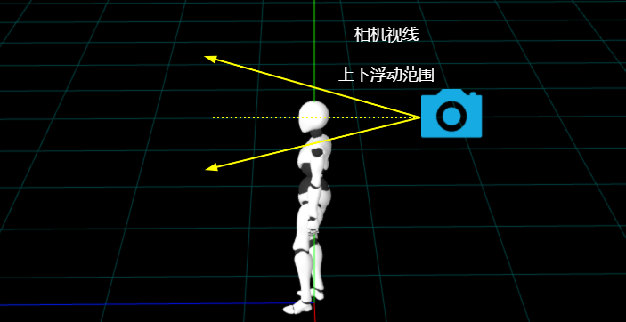

# 鼠标上下移动只改变相机视角

## 概述

+ 鼠标上下移动后，只改变相机视角，但是不改变玩家角色模型的姿态角度
+ 换句话说，就是玩家角色模型始终站在地面上不会倾斜

## 注意点 不能改变 .rotation.x 的值

+ `event.movementY` 的值改变 `player.rotation.x` 的值，这样虽然可以通过player控制子对象相机视角上下俯仰，但是玩家角色模型也必须跟着旋转，这样会改变人与地面位置关系

  ```js
  document.addEventListener('mousemove', (event) => {
    if(leftButtonBool){
      // 左右旋转
      player.rotation.y -= event.movementX / 600;
      // 玩家角色绕x轴旋转  视角上下俯仰
      player.rotation.x -= event.movementY / 600;
    }
  });
  ```

## 解决办法 鼠标上下移动只改变相机视角，不改变player角度

+ 可以在相机 `camera` 和玩家角色模型 `player` 之间，嵌入一个子节点 `cameraGroup` ，作为相机的父对象，作为玩家角色模型player的子对象

  ```js
  // 层级关系：player  <—— camera
  player.add(camera);//相机作为player子对象
  ```

  ```js
  // 层级关系：player <—— cameraGroup <—— camera
  const cameraGroup = new THREE.Group();
  cameraGroup.add(camera);
  player.add(cameraGroup);
  ```

+ 通过 `camera` 的父对象 `cameraGroup` 控制相机姿态角度变化

  ```js
  document.addEventListener('mousemove', (event) => {
    if(leftButtonBool){
      // 左右旋转
      player.rotation.y -= event.movementX / 600;
      // 鼠标上下滑动，让相机视线上下转动
      // 相机父对象cameraGroup绕着x轴旋转,camera跟着转动
      cameraGroup.rotation.x -= event.movementY / 600;
    }
  });
  ```

## 限制视线上下浮动范围

+ 根据需要，约束上下浮动角度范围(例如：设置上下俯仰范围-15度~15度，共30度)

  

+ 判断 `.rotation.x` 小于-15度，就设置为-15度，大于15度，就设置为15度

  ```js
  // 上下俯仰角度范围
  const angleMin = THREE.MathUtils.degToRad(-15);//角度转弧度
  const angleMax = THREE.MathUtils.degToRad(15);

  document.addEventListener('mousemove', (event) => {
    if(leftButtonBool){
      // 左右旋转
      player.rotation.y -= event.movementX / 600;
      // 鼠标上下滑动，让相机视线上下转动
      // 相机父对象cameraGroup绕着x轴旋转,camera跟着转动
      cameraGroup.rotation.x -= event.movementY / 600;
      // 一旦判断.rotation.x小于-15，就设置为-15，大于15，就设置为15
      if (cameraGroup.rotation.x < angleMin) {
        cameraGroup.rotation.x = angleMin;
      }
      if (cameraGroup.rotation.x > angleMax) {
        cameraGroup.rotation.x = angleMax
      };
    }
  });
  ```
