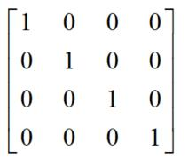

# 矩阵

## glMatrix.mat4.fromValues()创建4x4矩阵

+ 通过 `.fromValues()` 方法创建矩阵的时候，输入矩阵参数的顺序是按照矩阵列的顺序，一列一列输入到 `.fromValues()` 方法的参数

  ```js
  // 创建一个平移矩阵(沿着x、y、z轴分别平移1、2、3)
  //1   0   0    1
  //0   1   0    2
  //0   0   1    3
  //0   0   0    1
  //把矩阵按照列依次写入作为参数
  const mat4T = glMatrix.mat4.fromValues(1,0,0,0,  0,1,0,0,  0,0,1,0,  1,2,3,1);
  ```

  ```js
  //创建一个缩放矩阵(x、y、z分别缩放1、2、3)
  //1   0   0    0
  //0   2   0    0
  //0   0   3    0
  //0   0   0    1
  //把矩阵按照列依次写入作为参数
  const mat4S = glMatrix.mat4.fromValues(1,0,0,0,  0,2,0,0,  0,0,3,0,  0,0,0,1);
  ```

+ 通过浏览器控制台打印结果可以判断，glMatrix对象的相关方法创建的矩阵是通过类型化数据对象 `Float32Array` 表示

  ```js
  // 创建的矩阵其实就是用JavaScript的类型化数组表示的
  console.log('mat4T',mat4T);
  console.log('mat4S',mat4S);
  ```

## glMatrix.mat4.create()创建单位矩阵

+ `glMatrix.mat4.create()` 创建的是4x4单位矩阵

  ```js
  const mat4 = glMatrix.mat4.create();//单位矩阵

  console.log('mat4',mat4);
  ```

  

## 代码生成平移矩阵

+ 执行 `mat4.translate(mat4T,mat4,[2,0,0])` 表示根据参数3(`[2,0,0]`)创建一个沿着x轴平移2的平移矩阵，然后参数2(mat4)乘平移矩阵，计算结果赋值给参数1(mat4T)，mat4是单位矩阵不会改变平移矩阵

+ 参数2(mat4)是单位矩阵，不会影响参数3(`[2,0,0]`)生成的平移矩阵

  ```js
  const mat4 = glMatrix.mat4.create();//单位矩阵，辅助创建平移矩阵
  // 创建一个平移矩阵(沿着x平移2)
  const mat4T = glMatrix.mat4.create();
  glMatrix.mat4.translate(mat4T,mat4,[2,0,0]);
  console.log('mat4T',mat4T);

  ```

## 代码生成缩放矩阵

+ 代码生成缩放矩阵

  ```js
  const mat4 = glMatrix.mat4.create();

  // 创建一个缩放矩阵(x缩放10)
  const mat4S = glMatrix.mat4.create();
  glMatrix.mat4.scale(mat4S,mat4,[10,1,1]);
  console.log('mat4S',mat4S)
  ```

## 代码生成旋转矩阵

+ 代码生成旋转矩阵

  ```js
  const mat4 = glMatrix.mat4.create();

  // 生成一个旋转矩阵(绕z轴旋转45度)
  const mat4X = glMatrix.mat4.create();
  glMatrix.mat4.rotateX(mat4X,mat4,Math.PI/4);
  console.log('mat4X',mat4X);
  ```

  ```js
  const mat4 = glMatrix.mat4.create();

  // 生成一个旋转矩阵(绕z轴旋转45度)
  const mat4Y = glMatrix.mat4.create();
  glMatrix.mat4.rotateY(mat4Y,mat4,Math.PI/4);
  console.log('mat4Y',mat4Y);
  ```

  ```js
  const mat4 = glMatrix.mat4.create();

  // 生成一个旋转矩阵(绕z轴旋转45度)
  const mat4Z = glMatrix.mat4.create();
  glMatrix.mat4.rotateZ(mat4Z,mat4,Math.PI/4);
  console.log('mat4Z',mat4Z)
  ```

## 矩阵乘法运算.multiply(),生成模型矩阵

+ 矩阵乘法运算.multiply(),生成模型矩阵

  ```js
  // 创建一个平移矩阵(沿着x平移2)
  const mat4T = glMatrix.mat4.create();
  glMatrix.mat4.translate(mat4T,mat4,[2,0,0]);
  // 创建一个缩放矩阵(x缩放10)
  const mat4S = glMatrix.mat4.create();
  glMatrix.mat4.scale(mat4S,mat4,[10,1,1]);
  ```

  ```js
  // 矩阵乘法运算.multiply()
  const modelMatrix = glMatrix.mat4.create();//模型矩阵
  glMatrix.mat4.multiply(modelMatrix,modelMatrix,mat4S);//后缩放
  glMatrix.mat4.multiply(modelMatrix,modelMatrix,mat4T);//先平移
  console.log('modelMatrix',modelMatrix);
  ```

## 简化写法生成模型矩阵

+ 顶点先平移、后缩放

+ 沿着x平移2

+ x方向缩放10倍

  ```js
  const modelMatrix = glMatrix.mat4.create();

  //后发生缩放变换，先乘
  glMatrix.mat4.scale(modelMatrix, modelMatrix, [10, 1, 1]);
  //先发生平移变换，后乘
  glMatrix.mat4.translate(modelMatrix, modelMatrix, [2, 0, 0]);
  console.log('modelMatrix', modelMatrix);
  ```


