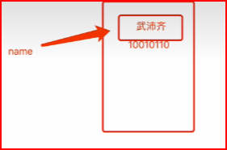
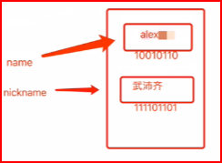

# 赋值及内存相关

## 解释

+ 示例1

  ```go
  name := "小刚刚"
  ```

  

+ 示例2

  ```go
  name := "小刚刚"
  nickname := name
  ```

  

+ 示例3

  ```go
  name := "小刚刚"
  nickname := name

  name := "alex"
  ```

  

## 注意事项

+ 使用 int string bool 这三种数据类型时，如果遇到变量的赋值会拷贝一份 *值类型*
