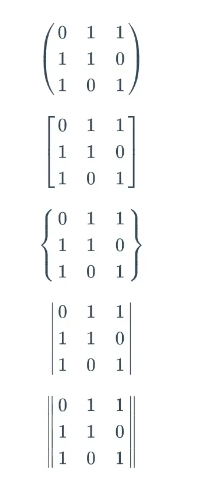

# markdown 中表示矩阵

## 基本语法

+ 学公式放在 `$$` 之间
+ 起始标记 `\begin{matrix}`，结束标记 `\end{matrix}`
+ 每一行末尾标记 `\\`，行间元素之间用 `&` 分隔

  ```
  $$\begin{matrix}
  0&1&1\\
  1&1&0\\
  1&0&1\\
  \end{matrix}$$
  ```

  $$\begin{matrix}
  0&1&1\\
  1&1&0\\
  1&0&1\\
  \end{matrix}$$

## 矩阵边框

+ 在起始、结束标记用下列词替换 `matrix`
+ `pmatrix` 小括号边框
+ `bmatrix` 中括号边框
+ `Bmatrix` 大括号边框
+ `vmatrix` 单竖线边框
+ `Vmatrix` 双竖线边框

  $$\begin{bmatrix}
  5&1&2\\
  3&0&5\\
  \end{bmatrix}$$

  

## 省略元素

+ 横省略号 `\cdots`
+ 竖省略号 `\vdots`
+ 斜省略号 `\ddots`

  ```
  $$\begin{bmatrix}
  {a_{11}}&{a_{12}}&{\cdots}&{a_{1n}}\\
  {a_{21}}&{a_{22}}&{\cdots}&{a_{2n}}\\
  {\vdots}&{\vdots}&{\ddots}&{\vdots}\\
  {a_{m1}}&{a_{m2}}&{\cdots}&{a_{mn}}\\
  \end{bmatrix}$$
  ```

  $$\begin{bmatrix}
  {a_{11}}&{a_{12}}&{\cdots}&{a_{1n}}\\
  {a_{21}}&{a_{22}}&{\cdots}&{a_{2n}}\\
  {\vdots}&{\vdots}&{\ddots}&{\vdots}\\
  {a_{m1}}&{a_{m2}}&{\cdots}&{a_{mn}}\\
  \end{bmatrix}$$

