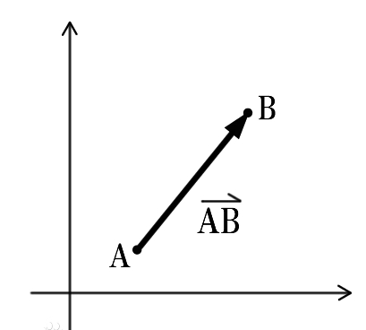
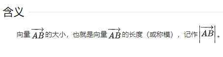

# 平面向量基础

## 定义

+ 平面向量是在二维平面内既有方向(direction)又有大小(magnitude)的量，物理学中也称作*矢量*
+ 与之相对的是只有大小、没有方向的数量（*标量*）

+ 平面向量用a,b,c上面加一个小箭头表示，也可以用表示向量的有向线段的起点和终点字母表示

  + 起点
  + 终点
  + 长度

  

## 相关概念

+ 向量的模：有向线段AB的长度叫做向量的模

  

+ 零向量：长度等于0的向量叫做零向量，记作0

+ 相等向量：长度相等且方向相同的向量叫做相等向量

+ 单位向量：模等于1个单位长度的向量叫做单位向量，通常用e表示
