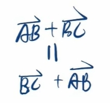
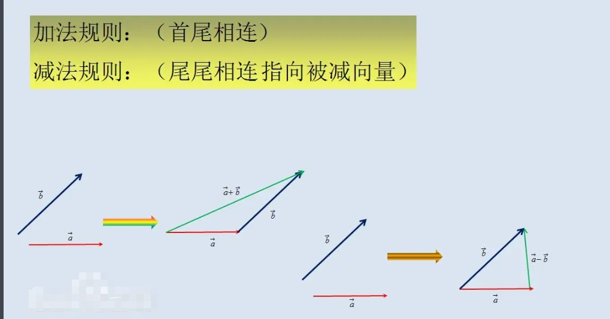
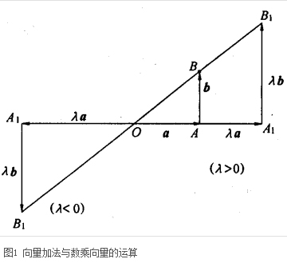
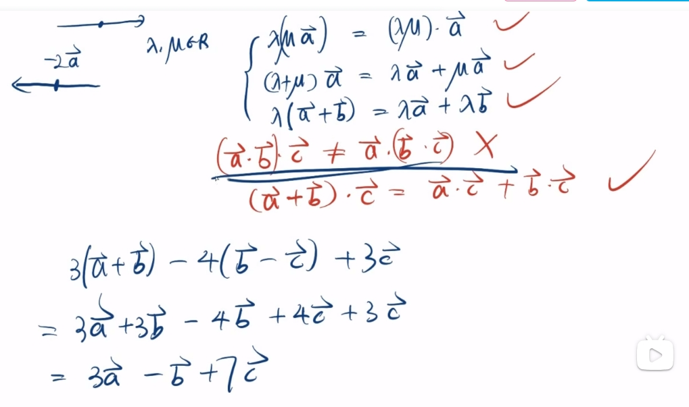

# 2.向量加减数乘法则

## 加法

+ 三角形法则：AB+BC=AC，这种计算法则叫做向量加法的三角形法则，简记为：首尾相连、连接首尾、指向终点

  

+ 四边形法则：已知两个从同一点A出发的两个向量AC、AB，以AC、AB为邻边作平行四边形ACDB，则以A为起点的对角线AD就是向量AC、AB的和，这种计算法则叫做向量加法的平行四边形法则，简记为：共起点 对角连

  

### 向量的加法满足所有的加法运算定律

+ 交换律

  

+ 结合律

  

## 减法

+ AB-AC=CB，这种计算法则叫做向量减法的三角形法则，简记为：共起点、连终点、指被减

  ```
  -(-a)=a
  a+(-a)=(-a)+a=0
  a-b=a+(-b)
  ```

  

## 数乘

+ 实数λ与向量a的积是一个向量，这种运算叫做向量的数乘，记作λa
+ 当λ>0时，λa的方向和a的方向相同，当λ<0时，λa的方向和a的方向相反
+ 当λ = 0时，λa=0

  

+ *注意点*：连续多个向量相乘，不符合交换律

  


