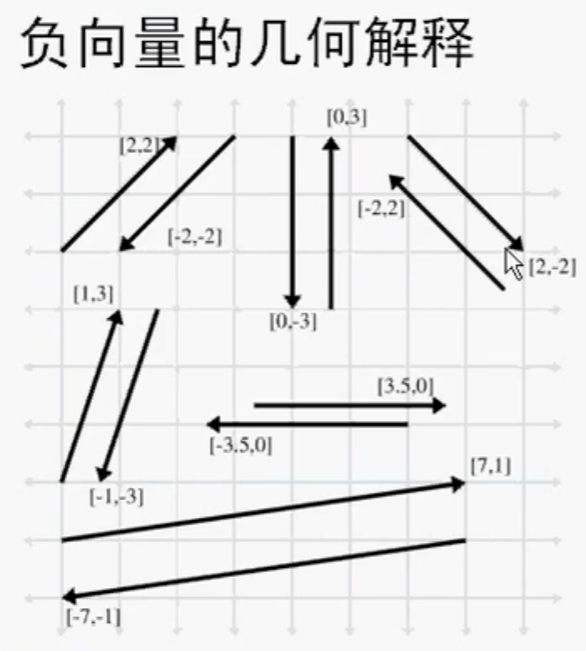
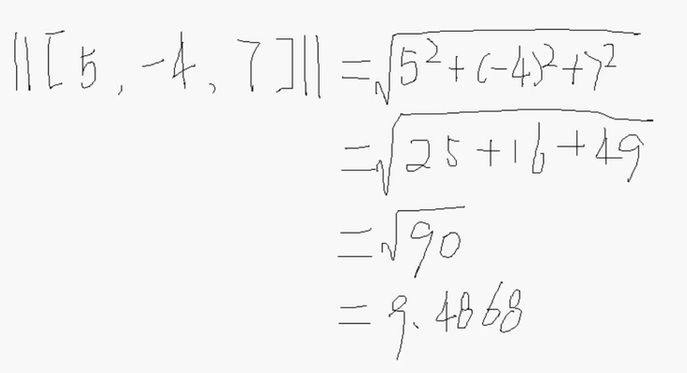

# 向量运算

## 零向量

+ 零向量：长度等于0的向量（向量里面是有的值都是0）叫做零向量，记作0
+ 没有方法的向量

  ```
  [0,0,0]
  ```

## 负向量

  
  

+ 负向量的几何解释

  

## 向量大小、长度、模

+ 向量的模：有向线段AB的长度叫做向量的模

  
  

+ 求向量的模

  ```js
  Math.sqrt(3 * 3 + 4 * 4); // 5
  ```

  

## 标量与向量的乘法

## 标准化向量

## 向量的加法和减法

## 距离公式

## 向量点乘

## 向量投影

## 向量叉乘
