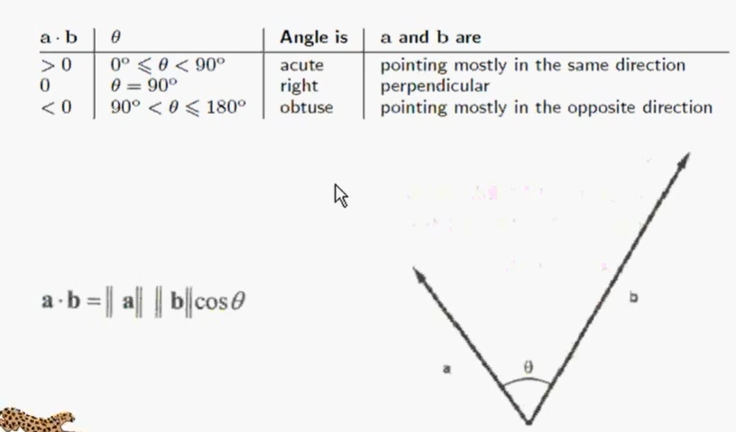

# 向量点乘

## 概述

+ 通过两个向量的点乘获取向量的夹角，等到的结果是一个标量

  

## 使用场景

+ 向量 a * b，得到的结果 α

  + α > 0，所以 `0° <= 夹角 < 90°` -----> 在同一个方向
  + α 等于 0，所以 `夹角 = 90°` ----------> 两个向量垂直
  + α < 0，所以 `90° < 夹角 <= 180°` ---> 在相反方向

  
