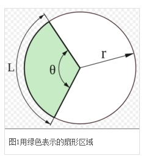

# 扇形

## 定义

+ 一条圆弧和经过这条圆弧两端的两条半径所围成的图形叫扇形（半圆与直径的组合也是扇形）

  

## 扇形弧长

+ 角度制（a是角度）

  ```
  l = απR / 180
  ```

+ 弧度制（a是弧度）

  ```
  l = a * r
  ```

## 周长

+ 扇形的周长的长度等于弧长和两个半径之和

## 扇形面积

+ 原始的公式（r是圆的半径，θ是圆心角角度）：算出圆的面积再算扇形，乘以扇形占总面积的比例

  ```
  S扇=θ/360°×S圆= θ/360° * π * +r²
  ```

  ```
  // 半径为 1cm的园，圆心角为 135° 的面积
  135/360 * 3.14 * (1 * 1)
  ```

+ 曲边三角形公式（L为扇形的弧长，r为圆的半径）：扇形看成底边弯曲成圆弧的三角形，面积还是1/2底乘高

  ```
  S扇= 1/2 × L * r
  ```

+ 弧度制下的半径与弧度表达式（α为圆心角弧度，r为半径）

  ```
  S扇= 1/2 * α * r²
  ```

## 扇形的弧长

+ 前置条件：扇形的半径为R，弧长为l，α(0<α<2π)为其圆心角

| 度量单位类别 |   α为角度制    |                      α为弧度制 |
| :----------- | :------------: | -----------------------------: |
| 扇形的弧长   | l = απR / 180  |                      l = a * R |
| 扇形的面积   | S = απR² / 360 | S = 1/2 * l * R = 1/2 * α * R² |
