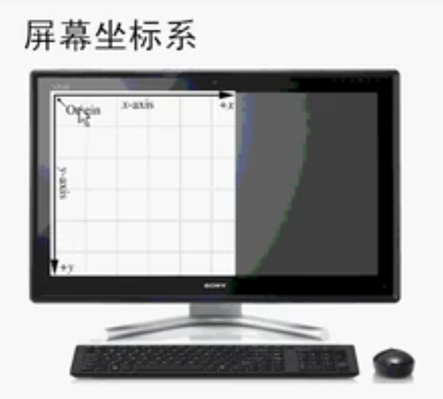

# 笛卡尔坐标系

## 1D坐标系 或 一维坐标系 或 数轴

+ 选某一坐标为坐标原点，以某个方向为正方向，选择适当的标度建立一个坐标轴，就构成了一维坐标系
+ 适于描述物体在一维空间运动（即物体沿一条直线运动）时物体的位置

  

## 2D 或 二维坐标系 或 平面坐标系

+ 在同一个平面上互相垂直且有公共原点的两条数轴构成平面直角坐标系，简称直角坐标系

  
  

## 2D 的方案

+ 有8种方案

  

+ 屏幕坐标系属于其中的一种

  
