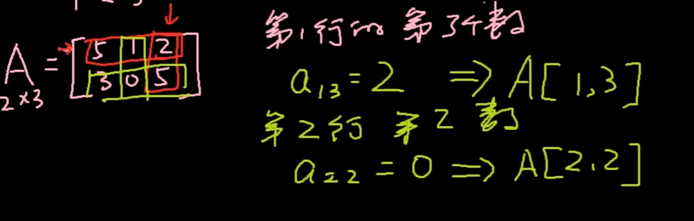

# 矩阵基础

## 定义

+ 矩阵（Matrix）是一个按照长方阵列排列的复数或实数集合

  
  

+ 由 m × n 个数aij排成的m行n列的数表称为m行n列的矩阵，简称m × n矩阵

  $$\begin{bmatrix}
  5&1&2\\
  3&0&5\\
  \end{bmatrix}$$

  + 第一行 `[5 1 2]`
  + 第二行 `[3 0 5]`

  
  

## 获取

  $$\begin{bmatrix}
  5&1&2\\
  3&0&5\\
  \end{bmatrix}$$

  

