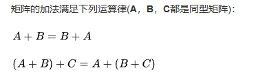

# 基本运算

## 概述

+ 矩阵运算在科学计算中非常重要
+ 而矩阵的基本运算包括矩阵的加法，减法，数乘，转置，共轭和共轭转置

## 加法

  

+ 矩阵的加法满足下列运算律(A，B，C都是同型矩阵)：

  

+ **注意** 只有 *同型矩阵* 之间才可以进行加法

## 减法

  

## 数乘

+ 矩阵与标量相乘

  

+ 矩阵与矩阵相乘：用第一个矩阵的行乘第二个矩阵的每一列

  

+ 矩阵的数乘满足以下运算律

  

  + 不符合交换律 A * B ≠ B * A

