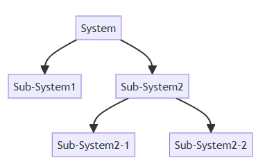

# 算法基本概念

## 什么是计算思维？

+ 2006 年，美国卡内基梅隆大学的 Jeannette M. Wing 教授首次提出了计算思维的概念

+ 谷歌公司为教育者开发了一套计算思维的课程：

  + 分解
  + 模式识别
  + 抽象
  + 算法

## 分解 decomposition

+ 将一个复杂的问题拆解成一个一个简单的问题，然后逐一击破

+ 比如在设计一个复杂的系统的时候，也会采用分解的思想

  

## 模式识别

+ 一些问题具备相同的属性或者说相似之处，这些相似之处被称之为 模式

+ 模式识别指的就是在一组数据中找出特征或规则，用于对数据进行分类，以作为决策判断的依据

## 抽象

+ 现实生活中：“抽象”，代表模糊不清的意思

+ 计算机科学：“抽象”，提取问题的关键部分，忽略无关紧要的细节部分

  ```js
  class Person{
    // 提取关键的信息，也就是这里程序会用到的信息
  }
  ```

+ 前端开发中组件库也是一种抽象，headless 无头组件库，更是一种抽象，专注于组件的逻辑功能

## 算法

+ 本质就是解决问题的方法和步骤

+ 将大象装入冰箱需要几个步骤？

  1. 打开冰箱门
  2. 将大象塞进去
  3. 关上冰箱门

+ 一瓶可乐和一瓶雪碧，如何做交换？

  1. 拿一个空瓶（A），将可乐瓶里面的可乐倒进去
  2. 将雪碧瓶里面的雪碧倒入空的可乐瓶
  3. 将瓶A里面的可乐倒入空的雪碧瓶

## 算法的条件（要求）

+ 一个算法必须要符合以下 5 个条件：

  1. 输入：一个算法有 0 个或者多个输入，并且这些输入要有明确的描述或者含义

  2. 输出：至少会有一个输出结果

  3. 明确性：算法设计中的每一个步骤必须是简洁明确的

  4. 有限性：你设计的算法在有限的步骤后会结束

  5. 有效性：算法的步骤清楚而且是可行，所谓可行，指的是只要时间允许，我甚至可以使用笔和纸来求出答案

## 算法的描述

+ 如何来做一个算法的表达，将我的算法设计传达给别人

  1. 自然语言描述：所谓自然语言，就是指中文、英文这种语言来描述算法。缺点：描述算法的时候比较冗余，而且通过自然语言描述算法的时候，对方容易产生理解上的偏差
  2. 流程图
  3. 伪代码

## 流程图

+ 椭圆：表示算法的开始和结束
+ 平行四边形：表示算法的输入和输出
+ 矩形：表示处理的步骤
+ 菱形：表示条件或者说分支
+ 流程线：连接上述的图形

  

## 伪代码

+ 伪代码也是有语法的规定的

+ 输入输出一个值

  ```js
  INPUT StudentName
  OUTPUT "You have made an error"
  OUTPUT StudentName
  OUTPUT "Student name is ", StudentName
  ```

+ 变量初始化

  ```js
  Counter ← 1
  Counter ← Counter + 1
  MyChar ← "A"
  LetterValue ← ASC(MyChar)
  StudentMark ← 40
  Percentage ← (StudentMark / 80) * 100
  Oldstring ← "Your mark is"
  NewString ← OldString & " ninety-seven"
  ```

+ 分支

  ```js
  IF MyValue > YourValue
  THEN
    OUTPUT "I win"
  ELSE
    OUTPUT "You win"
  ENDIF
  ```

+ 循环

  ```js
  Total ← 0
  FOR Counter ← 1 TO 10
  OUTPUT "Enter a number "
  INPUT Number
  Total ← Total + Number
  NEXT Counter
  OUTPUT "The total is ", Total
  ```
