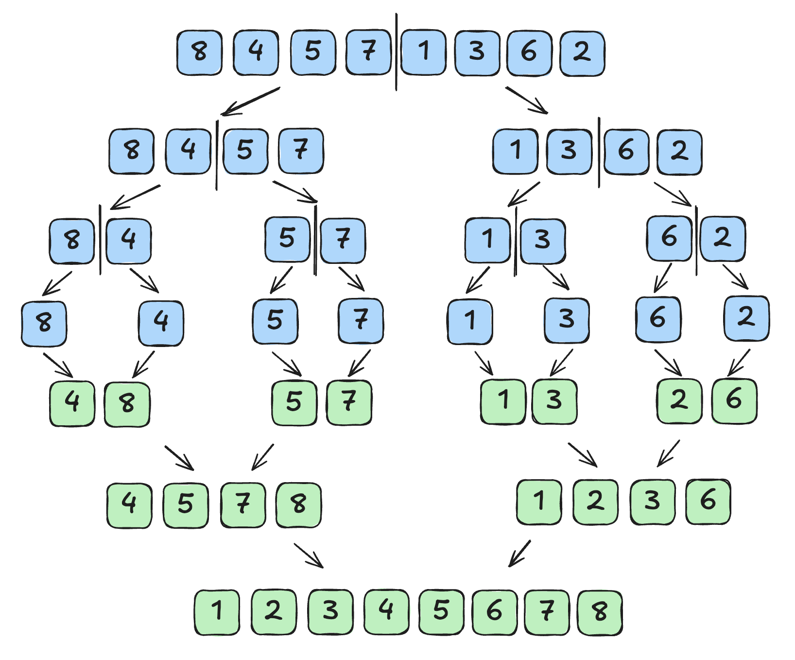

# 分治法

# 分治法

+ 英语里面叫做 divide and Conquer

## 核心思想

+ 将一个复杂的问题分解成多个简单的子问题，递归地求解这些子问题，如果子问题还是比较复杂，那么就继续进行拆分。最后再将所有子问题的解合并成最终解。

## 核心步骤

+ 步骤1 分解：将原来的问题分解为多个小问题
+ 步骤2 求解：递归的解决所有的子问题
+ 步骤3 合并：将所有子问题的解合并成原来问题的解

## 示例之 归并排序

+ 归并排序：就是典型的使用的是分治的思想：

  

+ 整个归并排序会经历：

  + 步骤1 分解：将待排序的数组不断的分成两个部分，直到不能再分解
  + 步骤2 求解：递归的将两个部分的数组进行归并排序
  + 步骤3 合并：将两个排序后的数组将其合并为一个排序好的数组

## 分治法 优缺点

+ 优点：简化问题

  + 通过分解一个大问题，将其全部转换为较为简单的子问题，从而易于求解

+ 缺点：往往需要一些额外的空间

  + 空间复杂度一般在 O(n) 左右
  + 分治法往往需要额外的存储空间来存储分解后的子问题
