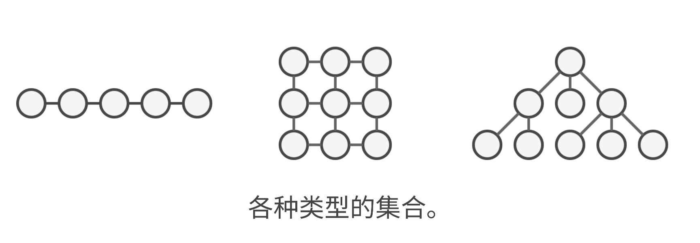
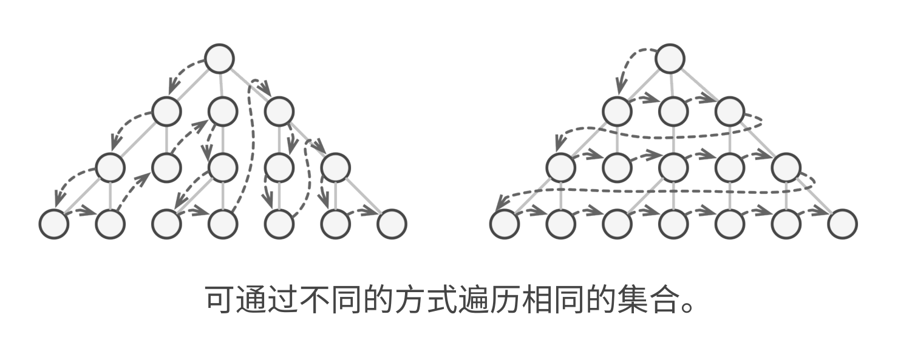
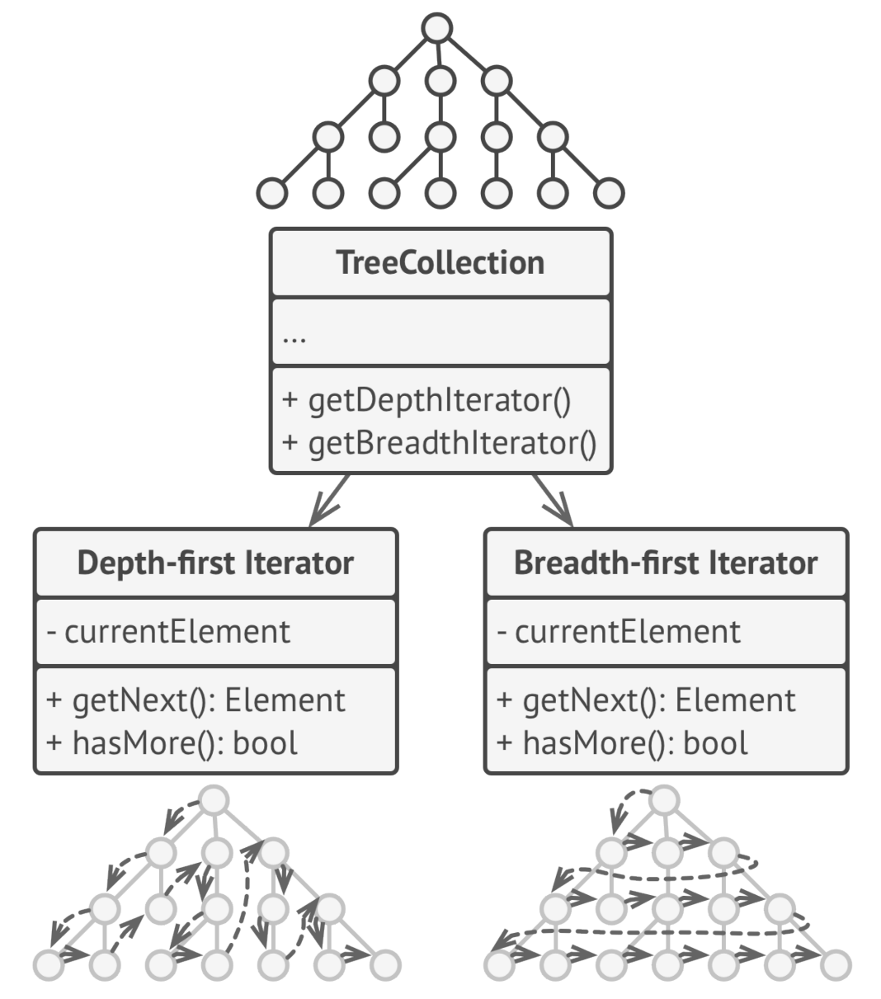

# 迭代器模式

## 前缀知识

+ JS 中天然所支持的迭代器模式：

  ```js
  const arr = [1, 2, 3, 4, 5];
  for(const i of arr) {
    console.log(i);
  }
  ```

+ 另外比如 ES6 提供的 Generator 函数，可以暂停函数的执行，当外部调用 Generator 函数的时候，返回的其实也就是一个迭代器

  ```js
  function* numberGenerator() {
    yield 1;
    yield 2;
    yield 3;
  }

  const gen = numberGenerator(); // "gen" 是一个迭代器

  console.log(gen.next().value); // 输出：1
  console.log(gen.next().value); // 输出：2
  console.log(gen.next().value); // 输出：3
  ```

## 概述

+ 迭代器模式的定义如下：

  + 这是一种行为设计模式，作用是在不暴露底层数据结构的情况下遍历集合中所有的元素

+ 集合是编程中用到最多的一种数据类型之一。集合的本质就是一组元素的容器，本身这个容器可以是多种多样的，例如数组就是集合的一种，除了数组以外，常见的还有栈、树、图

  

+ 无论集合的结构是什么样的，我们需要提供一种能够访问该集合中所有元素的能力。

+ 另外，访问一个集合中所有元素的方式可能还有好几种。

  + 数组：从前往后遍历、从后往前遍历
  + 树：深度优先遍历、广度优先遍历

  

+ 另外， 客户端并不关心集合内部是如何获取每一个元素的，我只需要你给我提供一个接口，我可以通过该接口获取到集合里面的每一个元素即可

+ 因此，我们就可以针对不同的迭代方式，进行一层抽象

  

+ 在上图中，你内部用深度优先算法也好，广度优先算法也罢，反正对外部提供一个统一的接口，外部通过调用这个接口来访问所有的元素。

+ 一般来讲，这个统一的接口会提供两个方法：

  + getNext：获取下一个元素
  + hasMore：是否还有没迭代完的元素
