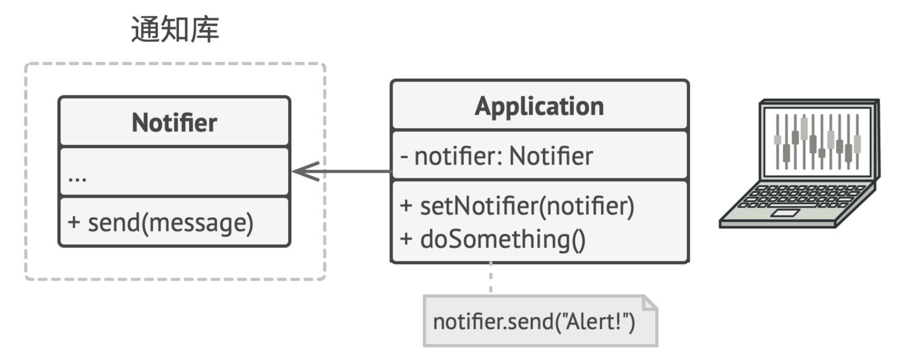
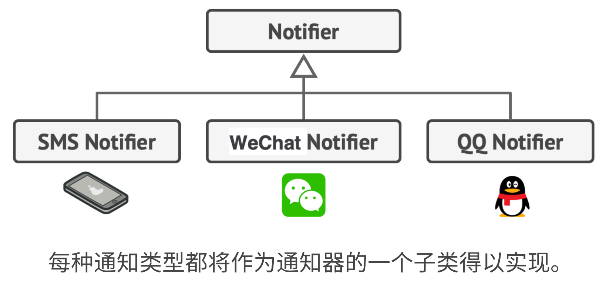
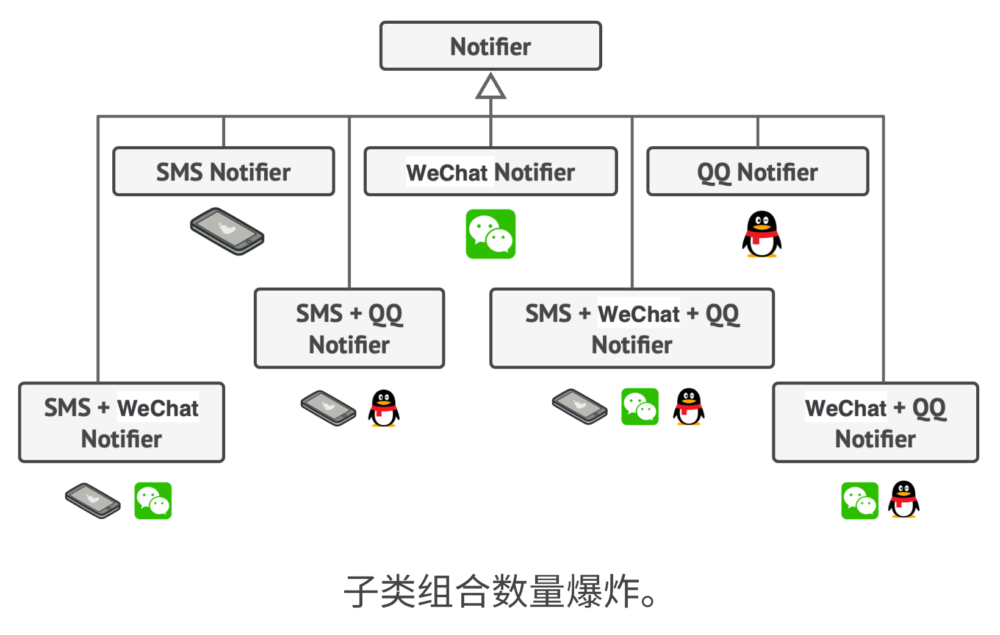
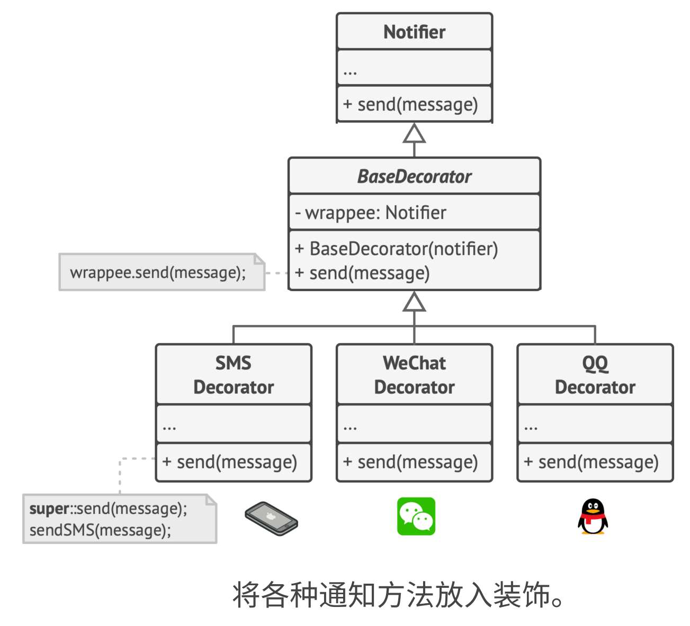
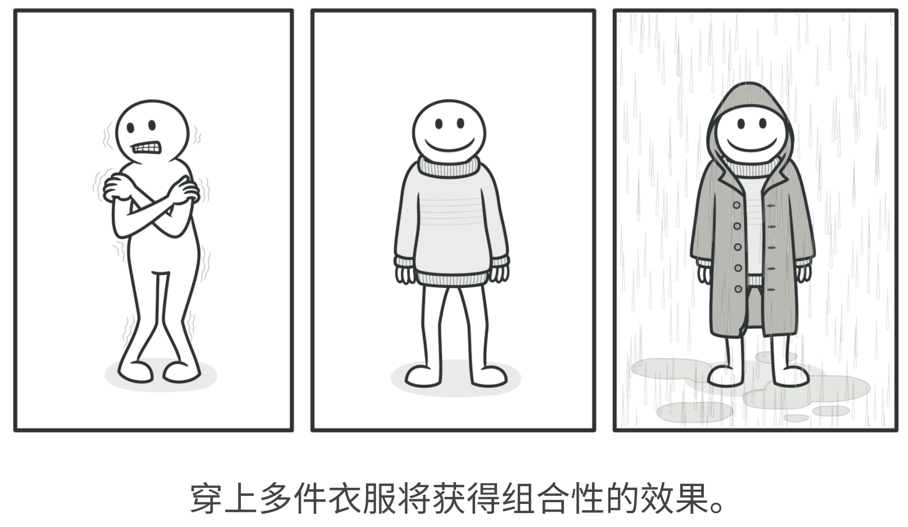
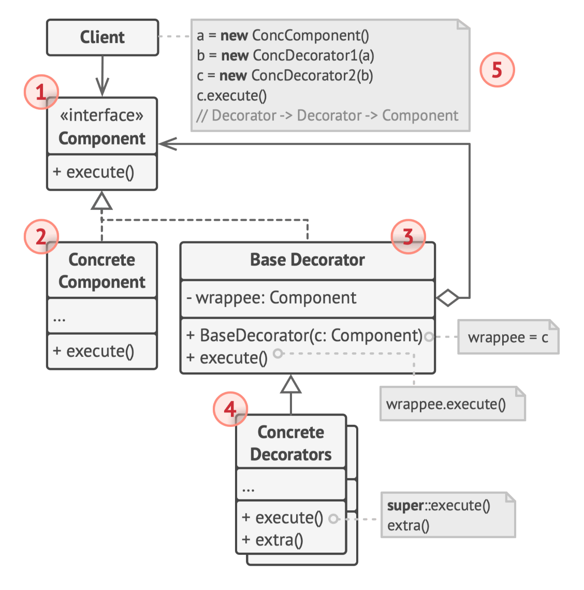

# 装饰器模式

## 概述

+ 在 TypeScript 里面就已经支持装饰器的语法了
+ Angular2 里面也大量的用到了装饰器，并且还是 Angular 的核心之一

  + 定义组件 `@Component`
  + 依赖注入 `@Injectable`
  + 输入属性 `@Input`

+ NestJS 里面也大量的用到了装饰器

 + 定义模块 `@Module`
 + 依赖注入 `@Injectable`
 + 定义控制器 `@Controller`

+ 就连原生 JS，目前也在考虑将装饰器纳入到标准里面

+ 装饰器的背后，其实就是一种设计模式的体现，那就是装饰器模式

## 定义

+ 装饰器模式定义：

  + 这是一种结构型设计模式，允许你将对象（A）放入包含行为的特殊对象里面，从而为原来的对象（A）绑定新的行为

+ 因此装饰器的本质，其实就是**组合**，而非继承

## 示例

+ 假设你现在需要一个有通知功能的库，其他程序可以用你这个库来发送一些重要的通知

+ 一开始的设计就是一个 Notifier 类，里面有几个成员变量：

  + 构造函数
  + 一个 send 方法：通过发送邮件的方式来发送通知

+ 其他程序使用你这个库的形式如下图所示：

  

+ 目前库的功能是 OK 的，但是需求变化了！

+ 许多客户端希望通过不同的方式来收到通知，例如通过发送短信、微信、QQ，那么此时我们就会去扩展 Notifier 这个类，创建一些子类：

  

+ 好像上面的需求也能够完美的解决

+ 但是，需求又变化了！

  + 有些客户期望多个渠道收到通知，比如有客户希望微信和 QQ 同时收到通知，有客户端希望短信和微信收到通知....

  + 这个时候你就会发现，如果还是按照之前的设计，那么子类的数量会成倍的增加

  

## 优化

+ 像这种场景下，最佳的解决方案是使用组合而非继承，这也是前面在介绍设计原则的时候，其中就提到了组合优于继承

+ 此时我们就可以使用装饰器模式，新的结构如下

  

## 组合

+ 组合这种思想，在现实生活中也是存在的：

+ 例如穿衣服就是一个使用装饰的例子

  + 觉得冷时，你可以穿一件毛衣
  + 如果穿毛衣还觉得冷，你可以再套上一件夹克
  + 如果遇到下雨，你还可以再穿一件雨衣

  

+ 所有这些衣物都“扩展”了你的基本行为，但它们并不是你的一部分，如果你不再需要某件衣物，可以方便地随时脱掉

## 具体类图

+ 装饰器模式的类图如下：

  

  1. 部件：声明装饰器和被封装对象的一个公共接口
  2. 具体的部件：具体的部件会去执行在部件中所定义的方法
  3. 装饰器的基础类：在装饰器基础类内部，会定义统一的接口方法，回头具体的各个装饰器，会实现该方法
  4. 具体的装饰器类：首先会继承装饰器的基础类，然后提供接口方法的不同实现
  5. 客户端：可以使用多层的装饰器来封装具体的部件，从而达到功能增强的效果
