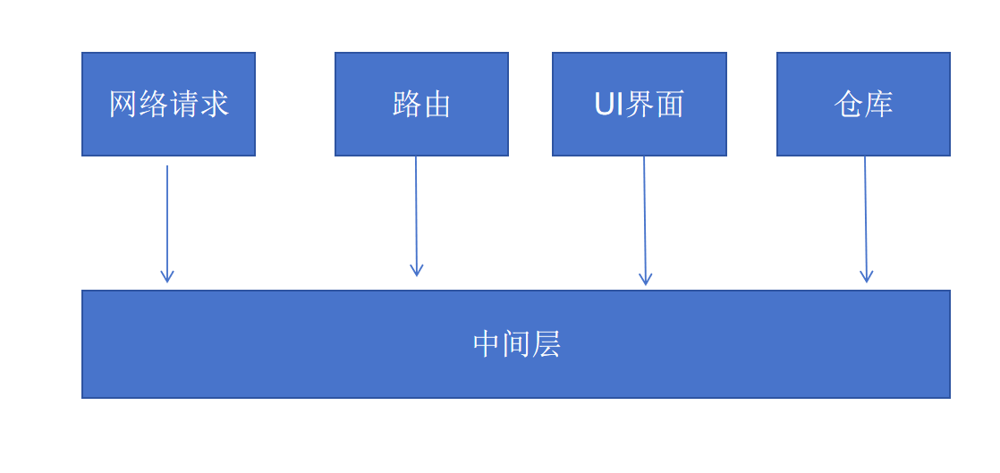

# 网络通信与路由仓库解耦

## 解决的问题

+ axios 请求与 路由、仓库绑定太深

  + 与 路由模块和UI模块 耦合，不利于后续的维护，


  ```js
  import axios, {AxiosRespone} from "axios";
  import router from "./router";
  import {message} from "adt-design-vue";

  const ins = axios.create({
    baseURL: "http://localhjost:3000"
  });

  // 响应拦截器之成功的响应
  const successHandlef = (res: AxiosRespone):any => {
    // ...
  }

  // 响应拦截器之失败的响应
  const errorHandlef = (error:any):any => {
    // 与 路由模块和UI模块 耦合


    if(error.respones.status === 400) {
      message.error("参数错误");
    } else if(error.respones.status === 401) {
      // 情况1 跳转到登录页
      if() {
        message.error("登录失败，请重新登录");
        router.push('/login');
      } else

      // 直接在当前页面弹框登录
      if(router.currentRoute.path !== '/abc') {
        // 显示弹出框
      }
    }
  }

  // 响应拦截器
  ins.interceptors.response.use(successHandlef, errorHandlef);
  ```

## 解决办法

+ 使用发布订阅者模式

  

+ 使用事件中心

  ```js
  // eventEmitter.ts 事件中心
  import mitt from 'mitt';

  type Events = {
     'API:UN_AUTH': string; // 没有权限
     'API:INVALID': string; // 参数错误
   };

  const emitter = mitt<Events>();

  export default emitter;
  ````

+ 网络请求

  ```js
  import axios, {AxiosRespone} from "axios";
  import event from "./eventEmitter";

  const ins = axios.create({
    baseURL: "http://localhjost:3000"
  });

  // 响应拦截器之成功的响应
  const successHandlef = (res: AxiosRespone):any => {
    // ...
  }

  // 响应拦截器之失败的响应
  const errorHandlef = (error:any):any => {
    if(error.respones.status === 400) {
      // message.error("参数错误");
      event.emit('API:INVALID')
    } else if(error.respones.status === 401) {
      event.emit('API:UN_AUTH')
    }
  }

  // 响应拦截器
  ins.interceptors.response.use(successHandlef, errorHandlef);
  ```

+ 路由中心 router.ts

  ```js
  import {createRouter, createWebHistory} from 'vue-router';
  import event from "./eventEmitter";

  const router = createRouter({
    history: createWebHistory(),
    routes: []
  });

  // 事件处理
  event('API:UN_AUTH', () => {
    message.error("登录失败，请重新登录");
    router.push('/login');
  });

  event('API:INVALID', () => {

  });

  export default router;
  ````
