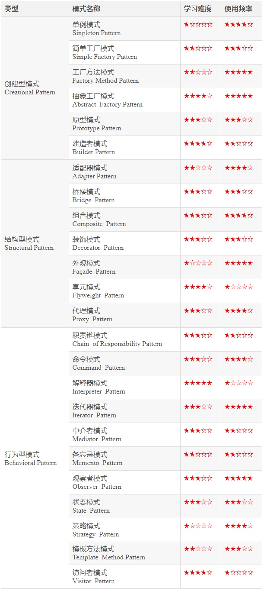

# 模式分类

## 概述

+ 在这 23 种模式中，可以根据意图或者目的来进行分类：

  + 创建型模式：提供一种**创建对象的机制**，增加已有代码的灵活性和复用性
  + 结构型模式：介绍如何**将对象和类组装成较大的结构**，并同时保持结构的灵活和高效
  + 行为型模式：负责**对象间的高效沟通和职责分配**

  
  

## 创建型-研究高效的创建对象

+ 单例模式
+ 简单工厂模式
+ 工厂方法模式
+ 抽象工厂模式
+ 原型模式
+ 建造者模式

## 结构型模式-设计对象的结构和关系

+ 适配器模式
+ 桥接模式
+ 组合模式
+ 装饰模式
+ 外观模式
+ 享元模式
+ 代理模式

## 行为型模式-设计对象的行为

+ 职责链模式
+ 命令模式
+ 解释器模式
+ 迭代器模式
+ 中介者模式
+ 备忘录模式
+ 观察者模式
+ 状态模式
+ 策略模式
+ 模板方法模式
+ 访问者模式

