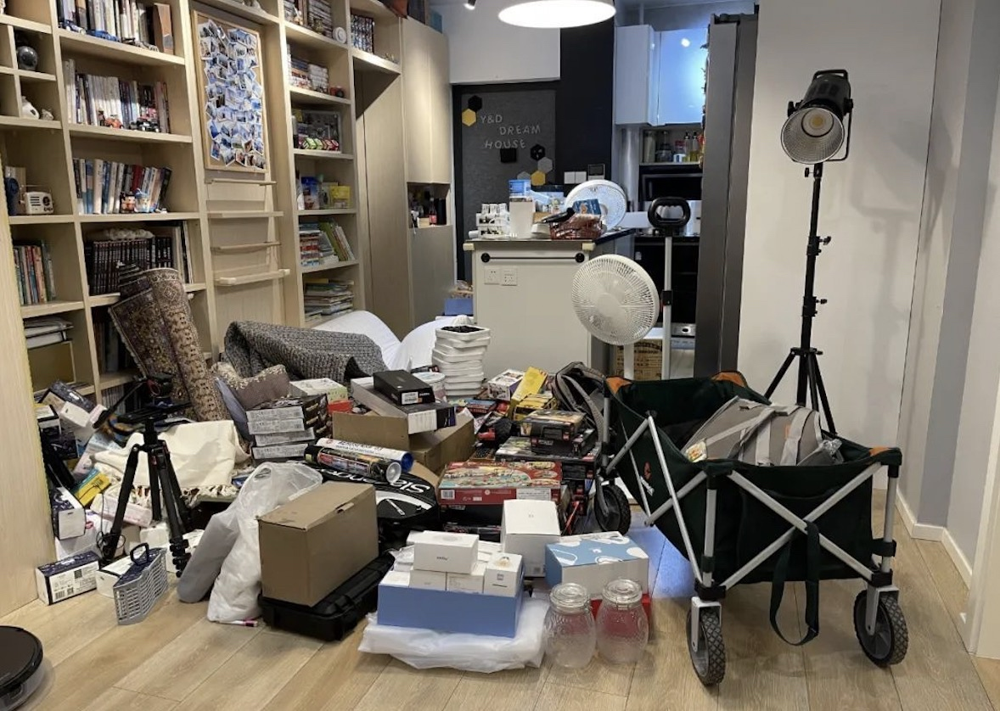

# 设计模式适用性

## 概述

+ 从某些角度来看，设计模式确实有可能带来代码量的增加，或许也会把系统的逻辑搞得更复杂
+ 但软件开发的成本并非全部在开发阶段，设计模式的作用是让人们写出可复用和可维护性高的程序

+ 例如

  + 假设有一个空房间，我们要日复一日地往里面放一些东西
  + 最简单的办法当然是把这些东西直接扔进去，但是时间久了，就会发现很难从这个房子里找到自己想要的东西，要调整东西的位置也不容易

    

  + 所以在房间里做一些柜子也许是个更好的选择，虽然柜子会增加我们的成本，但它可以在维护阶段为我们带来好处
  + 使用这些柜子存放东西的规则，或许就是一种模式

    

+ 所有设计模式的实现都遵循一条原则，即“找出程序中变化的地方，并将变化封装起来”

+ 一个程序的设计总是可以分为可变的部分和不变的部分

  + 当我们找出可变的部分，并且把这些部分封装起来，那么剩下的就是不变和稳定的部分
  + 这些不变和稳定的部分是非常容易复用的
  + 这也是设计模式为什么描写的是可复用面向对象软件基础的原因

+ 设计模式被人误解的一个重要原因是人们对它的误用和滥用，比如将一些模式用在了错误的场景中，或者说在不该使用模式的地方刻意使用模式。特别是初学者在刚学会使用一个模式时，恨不得把所有的代码都用这个模式来实现
+ 锤子理论在这里体现得很明显：当我们有了一把锤子，看什么都是钉子

  + 拿足球比赛的例子来说，我们的目标只是进球，“下底传中”这种“模式”仅仅是达到进球目标的一种手段
  + 当我们面临密集防守时，下底传中或许是一种好的选择
  + 但如果我们的球员获得了一个直接面对对方守门员的单刀机会，那么是否还要把球先传向边路队友，再由边路队友来一个边路传中呢？

+ 答案是显而易见的，模式应该用在正确的地方
+ 而哪些才算正确的地方，只有在我们深刻理解了模式的意图之后，再结合项目的实际场景才会知道
